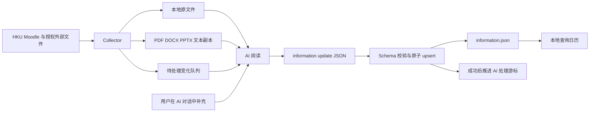

# HIQS 架构与数据流

HIQS 把课程资料收集、AI 理解和日历展示分开。程序不通过脆弱的规则推断完整 Assessment；
它负责完整保存资料、提供可读副本、验证 AI 写入的事实，并把事实确定性映射到日历。

## 主链路



职责边界：

- Collector：发现 Moodle 活动、下载文件、记录来源与失败，不判断哪些事项最重要；
- AI：阅读原文件或文本副本，识别课程、tutorial、DDL、课业要求、形式和占分；
- Information Service：检查类型、范围、唯一 ID、课程引用与时间关系，原子写入；
- Change Queue：区分首次全量与后续增量，提供精确文件路径并记录处理游标；
- Calendar：只读投影，展开重复时间并显示具体项目；
- 用户：授权资料范围，并可通过 AI 对话确认额外事实或更正。

## 四层代码结构

```text
src/hsas/
├── interfaces/       CLI、本地 HTTP API、HTML/CSS/JavaScript
├── application/      信息 upsert、资料检索与课程同步用例
├── domain/
│   ├── information/  information.json 与 update 的严格模型
│   └── courses/      Moodle 归档、文件与文本分析模型
└── infrastructure/
    ├── moodle/       登录、发现、下载和快照事务
    ├── documents/    PDF、DOCX、PPTX 文本提取
    ├── storage/      原子 JSON/文件持久化
    └── runtime/      本地数据目录
```

依赖方向保持：

```text
interfaces ──> application ──> domain
     │
     └───────> infrastructure ──> application ports + domain
```

领域层不依赖 Typer、Playwright、HTTP 服务或文件系统。应用层通过
`InformationRepository` 端口保存信息库，基础设施层提供 JSON 实现。

## Moodle Collector

一次同步在 staging 目录内完成，成功后才替换上一份课程快照：


下载器接受 Moodle `pluginfile.php` 附件及非 HTML 文件响应，不以少量扩展名作为唯一
白名单。文件受最大大小、超时和并发配置约束。原始字节不执行，只写入本地。

Google Workspace 链接是受控例外：`docs.google.com/document`、`presentation` 和
`spreadsheets` 链接分别尝试导出 DOCX、PPTX、XLSX。若导出返回登录页或权限页，活动
标为 external，并记录原因。

条件请求使用 ETag 和 Last-Modified；内容未变时复用原路径。失败同步不覆盖上一份有效
课程目录。

## AI 可读资料

每个 `StoredFile` 保存：

- 原文件名、本地相对路径与已清理的来源 URL；
- MIME type、字节数、SHA-256、下载和校验时间；
- 若可提取，保存 extraction method、状态、文字量、警告和文本副本路径。

文本副本位于课程目录的 `analysis/text/`：

- PDF 使用 `--- Page N ---`；
- PPTX 使用 `--- Slide N ---` 并附 speaker notes；
- DOCX 包含正文及可见的页眉、页脚、脚注、尾注和批注文本。

`hsas materials list` 输出所有原文件和文本副本的绝对路径，方便 AI 直接读取；
`hsas materials search` 对已有文本副本作本地检索。没有文本副本不代表文件不存在，
AI 仍可按格式使用相应文档工具。

## Incremental AI Review

每次成功同步都会比较上一份快照，并把活动、Moodle 日期和课件的新增、修改或删除写入
`courses/<course_id>/changes/history/`。课件变化携带原文件、文本副本和来源 URL；历史记录
随课程快照事务保留。

`ai-state/change-checkpoint.json` 为每门课程保存 AI 已处理到的 `collected_at`。如果课程
没有游标，`changes show` 生成 `full` review；否则只汇总游标之后的 change sets。输出批次
携带 `acknowledge_through`，因此生成批次后发生的新同步会使旧批次失效。

```text
changes show → AI 阅读列出的 files → information apply --changes → checkpoint
```

信息写入失败时不推进 checkpoint。若信息已保存但确认游标失败，变化仍保持 pending，允许
安全重试。只有审查后确认不影响任何课程事实时，才使用带双重确认的独立 acknowledge。

## Information Store

`information.json` 是日历的唯一事实输入：

```text
InformationStore
├── schema_version
├── timezone
├── updated_at / updated_by
├── courses[]
│   ├── course_id / moodle_course_id / code / title / color
│   ├── semester / overview / objectives
│   ├── instructors / links
│   └── policies / notes / sources
└── items[]
    ├── item_id / course_id / title / category
    ├── date_status
    ├── opens_at / starts_at / ends_at / due_at / due_on / scheduled_on
    ├── recurrence
    ├── location / description
    ├── assessment_format / submission_method
    ├── weight_percent / word_limit
    └── requirements / policies / warnings / links / sources
```

类别覆盖课程、tutorial、lab、office hour、assignment、quiz、exam、presentation、
project、report、reading、deadline 和 other。

重复规则使用 Monday=0 到 Sunday=6，并带有效起止日期、开始/结束时间、排除日期和补课
日期。确认状态的事项必须有日期或重复规则；结束时间必须晚于开始时间；占分必须在 0–100。

## Upsert 事务

`InformationUpdate` 是 AI 写入格式。应用服务执行：

1. 要求显式 `--confirmed`；
2. 验证 update；
3. 读取并验证当前 store；
4. 按稳定 `course_id` 和 `item_id` 合并完整记录；
5. 验证合并结果中所有 item 都指向已存在课程；
6. fsync 临时文件后用 `os.replace` 原子替换。

省略记录会保留，更新中没有隐式删除。任何失败都发生在替换前。

## Calendar

本地 HTTP 服务只绑定 `127.0.0.1`。浏览器通过 `GET /api/information` 获取已经验证的
store。JavaScript 在当前 42 天月历网格内展开 weekly recurrence，按课程和全文筛选，
并把没有日期的事项单独列出。

课程概览也由同一个端点返回。课程概述与目的由 AI 根据官方资料归纳后写入已校验的
`information.json`；成绩构成由带 `weight_percent` 的事项汇总；全部课件和新增/修改标记
来自最新 Moodle archive 与 pending review。程序综合 activity 类型、标题、section 与
文件名，在学习材料/课程信息两大区内继续标记 Lecture、Tutorial、Notes、Exercises、
Reading、Assessment 等类型。页面不解析课件内容，也不会补猜缺失的课程事实。

日历详情显示 DDL、时间、地点、形式、提交方式、占分、字数、要求、政策、警告、链接和
来源。AI 写入的字符串使用 DOM `textContent`，不插入为 HTML。

## 有限兼容

旧 CLI 名称 `hsas` 和默认数据目录 `HSAS` 保留，以继续访问用户已经下载的资料。
读取旧 `course.json` 时会忽略历史 `assessments` 字段；Planner、Student Profile、
Execution Log、Assessment Parser 及其命令均已从代码库移除。
