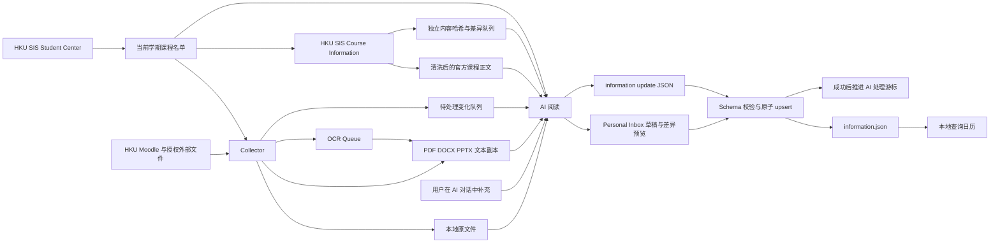
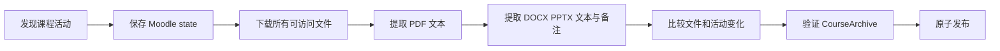

# HIQS 架构与数据流

HIQS 把课程资料收集、AI 理解和日历展示分开。程序负责完整保存资料、提供可读副本、验证
AI 写入的事实，并把事实确定性映射到日历；完整 Assessment 由 AI 依据来源归纳。

## 主链路



职责边界：

- Student Center Collector：读取当前学期注册课程名单，保存原始可读文本、课程代码和独立审阅 checkpoint；
- Collector：按注册课程发现 Moodle 活动、下载文件、记录来源与失败；
- SIS Course Information Collector：从 Student Center 课程代码查询官方课程页，清洗页面并保存可读副本、来源和内容哈希；
- AI：阅读原文件或文本副本，识别课程、tutorial、DDL、课业要求、形式和占分；
- Information Service：检查类型、范围、唯一 ID、课程引用与时间关系，原子写入；
- Change Queue：区分首次全量与后续增量，提供精确文件路径并记录处理游标；
- OCR Queue：识别扫描 PDF 与图片型 PPT，调用本地 OCR 并更新可搜索 sidecar；
- Personal Inbox：暂存用户通过 AI 补充的课程信息，并在逐字段预览与确认后进入统一校验；
- Calendar：只读投影，展开重复时间并显示具体项目；
- 用户：授权资料范围，并可通过 AI 对话确认额外事实或更正。

## CORE、MCP、UI 与 PORT

```text
src/hsas/
├── core/             业务模块及唯一公开 HIQSPort
├── mcp/              面向 AI 的 MCP tools
├── ui/               面向用户的本地 HTTP API 与生产静态资源
├── domain/           CORE 内部纯模型与规则
├── application/      CORE 内部用例
├── infrastructure/   CORE 内部来源、存储和运行时适配器
└── interfaces/       旧导入路径与 CLI 兼容层
ui/                    React + TypeScript 前端源码
```

`HIQSPort` 是 CORE 对外的聚合契约，由四个较小的能力接口组成：

- `InformationQueryPort`：信息、材料、证据与日历的只读查询；
- `InformationCommandPort`：经验证和明确确认的信息变更；
- `CourseSyncPort`：HKU 来源认证、同步与后台任务控制；
- `ApplicationLifecyclePort`：固定 commit 的本地应用更新。

MCP 与 UI 接受注入的 Port，不导入 domain、application、infrastructure 或彼此的实现：

```text
domain ← application ← infrastructure/composition ← CORE implements HIQSPort
                                                    ↑               ↑
                                                   MCP              UI
```

领域层保持纯模型与规则。内部应用用例通过 repository/gateway ports 使用外部系统，
基础设施提供实现；这些内部对象不会穿过 `HIQSPort`。后台同步线程、取消信号与状态快照
由独立的 `CourseSyncController` 管理，`CourseSyncWorkflow` 负责认证、并发来源采集、进度、
取消、精确重试和结果持久化。`DashboardProjectionService` 组合规范事实与各来源状态，生成
Dashboard 只读模型；`CourseRecordService`、`SourceReviewService`、`PersonalInboxService` 与
`MaterialQueryService` 分别负责规范记录变更、来源审阅游标、个人草稿和只读材料证据。它们
使用注入的 repository，并由 `HIQSCore` 组合。CORE façade 只维持稳定 Port、跨能力事务和
兼容入口。旧 `interfaces` 包保留 CLI 与兼容 import；CLI 的通用查询入口通过 CORE，仍需
终端交互回调的 collector 命令保留专用适配器。新增 AI 和用户入口必须分别放入 `mcp` 与 `ui`。

“需要确认”使用同一条只读链路：Dashboard read model 进入 application 层的确定性 attention
用例，生成 reason code、证据、缺失字段、严重程度、指纹与允许动作，再由
`InformationQueryPort.attention_snapshot()` 同时暴露给 MCP 和 UI。当前时间由 CORE 注入，
以便测试固定 14 天窗口；前端不重新判断风险。`GET /api/attention` 独立于首页主数据请求，
因此摘要失败不会阻断日历和资料。暂时忽略只写浏览器偏好，指纹变化后自动重新出现，绝不
修改 `information.json`。来源未覆盖不会产生冲突；只有既有 warning 明确记录的矛盾才生成
`SOURCE_CONFLICT`。

## Moodle Collector

一次同步在 staging 目录内完成，成功后才替换上一份课程快照：



下载器接受 Moodle `pluginfile.php` 附件及各类文件响应，并通过响应类型与来源规则确认
文件。文件受最大大小、超时和并发配置约束。原始字节仅写入本地存储。

对 URL、Page、Label 和其他 HTML 活动，下载器会从活动页开始做有界递归采集：跟随同源
Moodle 内容页、`pluginfile.php` 及文档链接，并解析中间 HTML 页的正文作为 Agent 证据。
默认最多 6 层、100 个中间页面和 200 个文件（可由 `MOODLE_MAX_LINK_DEPTH`、
`MOODLE_MAX_LINKED_PAGES`、`MOODLE_MAX_LINKED_FILES` 或 TOML 配置覆盖）。同一 URL 只
访问一次，Moodle 导航页、外部普通链接和超出预算的分支不会继续爬取；若触及上限，活动
会标记 `metadata.recursive_collection_truncated` 并保留实际限制，避免 Agent 把不完整
结果误认为完整清单。

Google Workspace 链接是受控例外：`docs.google.com/document`、`presentation` 和
`spreadsheets` 链接分别尝试导出 DOCX、PPTX、XLSX。若导出返回登录页或权限页，活动
标为 external，并记录原因。

条件请求使用 ETag 和 Last-Modified；内容一致时复用原路径。失败同步期间继续使用上一份
有效课程目录。

## AI 可读资料

每个 `StoredFile` 保存：

- 原文件名、本地相对路径与已清理的来源 URL；
- MIME type、字节数、SHA-256、下载和校验时间；
- 若可提取，保存 extraction method、状态、文字量、警告和文本副本路径。

文本副本位于课程目录的 `analysis/text/`：

- PDF 使用 `--- Page N ---`；
- PPTX 使用 `--- Slide N ---` 并附 speaker notes；
- DOCX 包含正文及可见的页眉、页脚、脚注、尾注和批注文本。

Moodle 页面自身的 Text and media area、活动说明等可见正文保存在对应 activity 的
`metadata.content_text`。HTML 表格不保存为可执行页面，而是转换为
`metadata.content_tables` 的 caption/row/cell 结构，保留空单元格、表头及 rowspan/colspan。
这些页面证据与文件 sidecar 一同进入本地检索；正文或表格变化也会生成增量审阅记录。

`hsas materials list` 输出所有原文件和文本副本的绝对路径，方便 AI 直接读取；
`hsas materials search` 对已有文本副本作本地检索。原文件始终保留，AI 可按格式使用相应
文档工具读取各类资料。

HKU SIS 课程页面保存在 `sis-course-info/courses/<COURSE_CODE>/latest.txt` 与
`latest.html`。采集器只截取可见课程正文、移除 PeopleSoft 导航和会话状态，并记录安全的
Subject/Catalogue URL 与 SHA-256。课程事实保持由 AI 阅读，页面结构差异不会进入固定事实
parser。当前学期课程名单保存在 `sis-enrollment/latest.json`，Student Center 可见正文
保存在 `sis-enrollment/latest.txt`；课程名单的变化使用独立 batch 与 checkpoint 交给 AI
审阅。相同课程的多个 Moodle section 共用一份 SIS 来源。Class Planner 与 SIS 访问器
共享持久化 HKU Portal browser profile；SIS 登录从 `z_signon.jsp` 开始，并由用户在可见
窗口完成可能出现的图形验证码。统一同步先完成登录与 Student Center 课程名单采集，随后由
application 层的 `UnifiedCourseSyncService` 编排来源任务。infrastructure 层的
`BrowserSessionBroker` 在整个采集阶段只打开一个 headless Chromium context，Moodle、SIS
Course Information 和 Class Planner 各自使用独立 page 并通过 `asyncio.gather` 并发运行。
来源分别写入自己的目录，聚合状态只在锁内更新。

提取器会把文字覆盖不足的扫描 PDF 和图片型 PPT 标为 `ocr_required`。`hsas ocr status`
读取这些分析记录生成队列，`hsas ocr run --confirmed` 使用本地 Apple Vision 或
Tesseract/Poppler 批量识别。识别结果追加到文本副本并重新计算哈希、摘要、关键词和阅读
时间，随后原子更新对应 `course.json`。

## Incremental AI Review

每次成功同步都会比较上一份快照，并把活动、Moodle 日期和课件的新增、修改或删除写入
`courses/<course_id>/changes/history/`。课件变化携带原文件、文本副本和来源 URL；历史记录
随课程快照事务保留。

`ai-state/change-checkpoint.json` 为每门课程保存 AI 已处理到的 `collected_at`。课程等待
首个游标时，`changes show` 生成 `full` review；已有游标时则汇总之后的 change sets。输出批次
携带 `acknowledge_through`，因此生成批次后发生的新同步会使旧批次失效。

```text
changes show → AI 阅读列出的 files → information apply --changes → checkpoint
```

checkpoint 在信息写入成功后推进。信息已保存而游标确认失败时，变化保持 pending 以支持
安全重试。审查确认课程事实保持一致时，使用带双重确认的独立 acknowledge。

HKU SIS 页面使用 `sis-course-info/history/` 和 `review-checkpoint.json` 维护独立增量队列。
AI 先阅读变更记录指向的 `text_relative_path`，并以 `source_type: sis_course_info` 引用来源。
Moodle 当前页面、活动元数据、公告与课程资料拥有最高优先级；SIS 和 Class Planner 补充
Moodle 未陈述的事实。来源冲突时采用 Moodle 支持的值，同时保留双方证据与警告。

## Information Store

`information.json` 是日历的唯一事实输入：

```text
InformationStore
├── schema_version
├── timezone
├── updated_at / updated_by
├── courses[]
│   ├── course_id / moodle_course_id / code / title / color
│   ├── semester / starts_on / ends_on / overview / objectives
│   ├── instructors / links
│   └── policies / notes / sources
└── items[]
    ├── item_id / course_id / title / category
    ├── date_status
    ├── opens_at / starts_at / ends_at / due_at / due_on / scheduled_on
    ├── recurrence
    ├── location / description
    ├── assessment_format / submission_method
    ├── weight_percent / word_limit
    └── requirements / policies / warnings / links / materials / sources
```

类别覆盖课程、tutorial、lab、office hour、assignment、quiz、exam、presentation、
project、report、reading、deadline 和 other。

重复规则使用 Monday=0 到 Sunday=6，并带有效起止日期、开始/结束时间、排除日期和补课
日期。确认状态的事项必须有日期或重复规则；结束时间必须晚于开始时间；占分必须在 0–100。

## Upsert 事务

`InformationUpdate` 是 AI 写入格式。应用服务执行：

1. 要求显式 `--confirmed`；
2. 验证 update；
3. 读取并验证当前 store；
4. 按稳定 `course_id` 和 `item_id` 合并完整记录；
5. 验证合并结果中所有 item 都指向已存在课程；
6. fsync 临时文件后用 `os.replace` 原子替换。

省略记录会保留，删除使用显式流程。任何失败都发生在替换前。

## Personal Inbox

`ai-state/personal-inbox.json` 保存 AI 根据用户明确陈述准备的 `InformationUpdate` 草稿。
每条草稿拥有稳定 ID、创建时间、备注和 pending/applied 状态。Dashboard 与
`hsas inbox list` 将草稿同当前 `information.json` 比较，呈现 create/update 动作以及
逐字段 before/after。用户确认单条草稿后，应用服务调用现有 Information upsert，再把
Inbox 条目标为 applied。

## Dashboard

本地 HTTP 服务只绑定 `127.0.0.1`。浏览器通过 `GET /api/information` 获取已经验证的
store，并通过独立的 `GET /api/attention` 获取只读的“需要确认”摘要。首页以一个入口先建立共享 HKU Portal 会话并运行 Student Center，再并发采集 Moodle、
SIS Course Information 与 Class Planner；单一进度条显示阶段、当前课程和完成数量。同时
集中本地刷新、资料状态、OCR 队列、Personal Inbox、资料搜索和 pending review 差异。日历作为
独立侧栏页面。React 岛使用 shadcn/ui 风格的本地组件、FullCalendar 和 Motion 呈现月、周、日
视图；旧 JavaScript 日历保留为静态资源缺失时的回退。两套视图共享课程与全文筛选，日期待确认
事项单独列出。前端构建产物固定写入 `src/hsas/ui/web/modern-assets/`，运行应用不依赖 Node。

课程概览也由同一个端点返回。课程概述与目的由 AI 根据官方资料归纳后写入已校验的
`information.json`；成绩构成由带 `weight_percent` 的事项汇总；全部课件和新增/修改标记
来自最新 Moodle archive 与 pending review。程序综合 activity 类型、标题、section 与
文件名，在学习材料/课程信息两大区内继续标记 Lecture、Tutorial、Notes、Exercises、
Reading、Assessment 等类型。课件内容由 AI 阅读，页面呈现经过验证的课程事实。

日历详情显示 DDL、时间、地点、形式、提交方式、占分、字数、要求、政策、警告、链接、
AI 关联的学习材料和来源。`GET /api/source-preview` 只接受当前课程快照中的白名单路径；PDF 与图片使用同源原文
预览，DOCX/PPTX 使用已提取文本预览，并保留打开原文件的入口。首页问答式搜索只匹配本地
结构化事项和课件目录。AI 写入的字符串使用 DOM `textContent` 作为纯文本呈现。

## macOS App 与发布包

`HIQS.app` 使用 Swift/AppKit 创建原生窗口，并以 WKWebView 承载 Dashboard。App 启动时从
源码构建配置指向当前项目的 `.venv/bin/hsas`；完整发布构建则从 Bundle Resources 运行
PyInstaller 冻结的 `hiqs-backend`。两种模式都会绑定随机回环端口，并从后端启动输出取得
地址后加载页面。窗口不提供地址栏，HTTP 服务继续限制在 `127.0.0.1`。

WKNavigationDelegate 允许回环页面导航，并把 Moodle 等外部 HTTP(S) 链接交给系统浏览器。
App 退出时终止它启动的后端子进程。源码构建使用现有项目环境和 Playwright 安装：
`scripts/build_macos_app.sh` 只编译 Swift Launcher、写入构建者自己的项目位置并生成 ad-hoc
签名的 `dist/HIQS.app`，本机路径不会进入 Git。

Dashboard 启动后通过固定的 GitHub raw version URL 只读比较版本。自动更新仅对官方
`origin` 的 Git 源码安装开放，并要求工作树干净、当前 HEAD 是 `origin/main` 的祖先；随后
使用 `git merge --ff-only`，仅在依赖文件变化时更新 `.venv` 与 Playwright，最后重建
`HIQS.app`。用户课程资料位于 Application Support，不参与源码更新。

DMG 构建脚本同时打包匹配的 Playwright Chromium，并通过
`PLAYWRIGHT_BROWSERS_PATH` 指向 Bundle 内浏览器，因此登录和同步不依赖额外安装步骤。

`scripts/build_macos_dmg.sh` 固定执行 Python 冻结、Swift 编译、Bundle 组装、ad-hoc 签名、
DMG 压缩与 SHA-256 输出。版本来自 `src/hsas/__init__.py`，并同步写入 Info.plist。

## 有限兼容

旧 CLI 名称 `hsas` 和默认数据目录 `HSAS` 保留，以继续访问用户已经下载的资料。
读取旧 `course.json` 时会忽略历史 `assessments` 字段；Planner、Student Profile、
Execution Log、Assessment Parser 及其命令均已从代码库移除。
