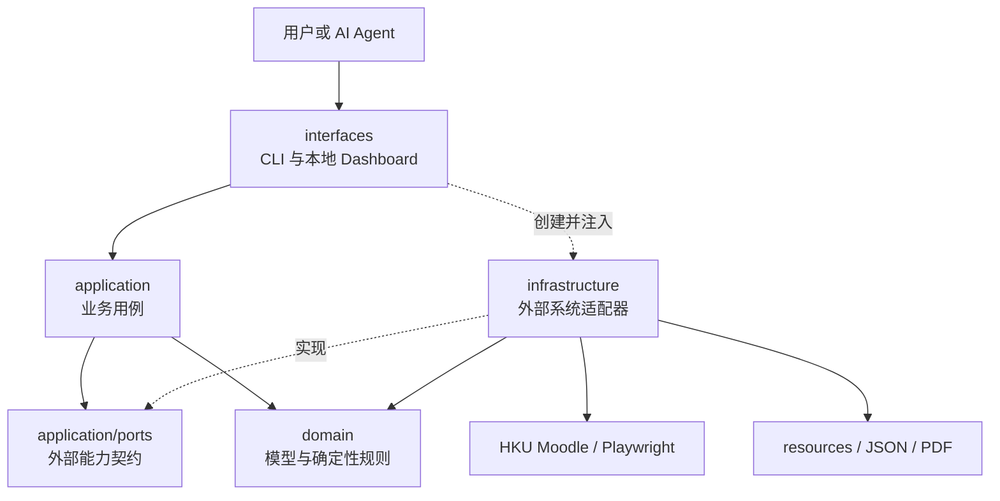
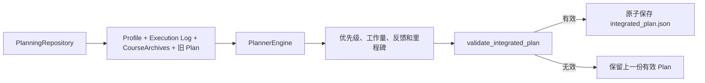

# HSAS — HKU Study Assistance System

> 把 Moodle 中分散的课程信息，转化为有依据、可执行的跨课程学习优先级。

HSAS 是面向 HKU 学生的本地学习辅助系统。它同步 Moodle 课程，整理作业、考试、截止日期、
占分和课件，帮助学生判断当前最值得投入的学习事项。系统也能通过本地 RAG 从课件中找出
相关内容，让 AI 根据真实课程资料解释知识、建议学习方法，并标明文件和页码来源。

你可以在本地 Dashboard 中查看优先事项、同步状态和课程资料，并记录真实学习进度。
个人资料、课程文件、登录状态和计划默认保存在本地数据目录。

## 目录

- [它解决什么问题](#它解决什么问题)
- [与相关产品的对比](#与相关产品的对比)
- [主要功能](#主要功能)
- [工作方式](#工作方式)
- [代码架构与工作流](#代码架构与工作流)
- [快速开始](#快速开始)
- [与 AI Agent 配合](#与-ai-agent-配合)
- [本地数据目录](#本地数据目录)
- [更多信息](#更多信息)
- [License](#license)

## 它解决什么问题

课程信息通常散落在 Moodle 页面、syllabus、公告、Label 和 PDF 中。多门课程同时进行时，
学生需要持续综合日期、工作量、重要程度和学习进度：

- 最近有哪些真正重要的 DDL 和考试？
- 权重、难度、剩余工作量和当前进度应该如何一起考虑？
- 一项大型作业应该从哪里开始，怎样拆成可完成的阶段？
- 当前任务对应哪些课件，应该怎样学习，怎样确认自己已经掌握？
- Moodle 更新后，旧计划是否仍然可信？

HSAS 将这些信息整理成带来源的课程数据库，再生成稳定、可验证的跨课程优先事项。
信息模型为未公布或证据不足的字段保留 unknown 状态和来源说明。

系统中的职责分为课程事实采集、确定性规划、本地 RAG 检索和 AI 学习解释。学生结合现实
安排选择具体学习日期和时间。

## 与相关产品的对比

| 使用场景 | Moodle | 待办或日历工具 | 通用 AI 助手 | HSAS |
|---|---|---|---|---|
| 课程信息 | 提供课程页面、公告、活动与课件 | 保存学生录入的任务和日期 | 根据对话中提供的内容作答 | 汇总 Moodle 中的课程任务、日期、占分、要求、课件与来源 |
| 多门课程安排 | 按课程分别展示内容 | 按日期、标签或手动顺序排列 | 根据当前对话提出建议 | 结合截止日期、占分、难度、所需时间和学习进度计算跨课程优先级 |
| 学习任务拆解 | 展示教师发布的要求 | 记录清单、日程和提醒 | 生成通用步骤或对话建议 | 根据论文、考试、项目和演示的特点生成阶段目标与完成标准 |
| 课件辅助学习 | 提供原始课程资料 | 关联手动添加的附件或链接 | 使用用户提供的文字和文件 | 通过本地 RAG 检索已同步课件，并返回课程、文件和页码来源 |
| 进度更新 | 展示活动状态和课程记录 | 由学生维护完成状态 | 在对话中接收进度信息 | 记录实际投入与完成进度，并据此刷新后续优先事项 |
| 数据位置 | 学校 Moodle 平台 | 取决于所用服务 | 取决于所用服务 | 课程文件、个人资料、计划和学习记录保存在本地数据目录 |

## 主要功能

### 汇总 Moodle 课程信息

完成 HKU 登录后，HSAS 可以同步全部课程或选择一门课程更新。课程中的作业、测验、考试、
截止日期、占分、要求和课件会集中整理，并保留它们来自哪个 Moodle 页面或文件。再次同步
时，系统会识别课程内容与日期的变化。

### 告诉你当前先做什么

HSAS 会把不同课程的任务放在一起比较，综合截止日期、占分、难度、预计所需时间、当前
准备程度和已经完成的进度，形成一份按重要程度排列的学习清单。每项任务会显示排序理由、
预计投入和完成标准，方便学生理解优先级的来源。

### 把大型任务拆成阶段

论文、考试、项目和演示会采用相应的准备方式拆分。例如，论文可以分为理解题目、查找资料、
列提纲、完成初稿和修改；考试可以分为知识回顾、题目练习、查漏补缺和模拟检验。每个阶段
都能作为当前任务的一部分跟踪。

### 从课件中找到学习依据

本地 RAG 可以根据概念、问题或当前任务检索已经同步的 PDF 课件。搜索结果包含相关正文、
课程、文件名和页码，可以直接回到原始课件核对。AI 可以使用这些结果解释知识、设计练习，
并给出自测方法。

### 根据真实进度更新计划

学生可以记录实际学习时间、完成比例和备注。计划刷新后会参考这些记录重新估计剩余工作，
保留仍然有效的进度，并调整后续事项的优先级。课程目标、学习偏好和现实限制也可以纳入
计划参考。

### 在本地 Dashboard 集中查看

Dashboard 集中展示优先事项、截止日期、排序理由、预计工作量、课程资料、同步状态和提醒。
学生可以从中完成 Moodle 登录与同步、浏览已下载课件、记录学习进度并刷新计划。偏好终端的
用户也可以通过 `hsas` 命令使用相同功能。

### 保留课程来源与有效结果

任务、日期和课件会保留来源信息，方便核对 Moodle 或原始文件。同步或更新遇到异常时，
系统会记录状态并继续保留最近一次成功整理的课程数据。软件代码与个人课程资料分别存放，
本地数据目录包含课件、计划、学习记录和登录状态。

## 工作方式

```text
HKU Moodle
    ↓
课程数据库：Assessment、DDL、课件与来源
    +
Student Profile + Execution Log
    ↓
Deterministic Planner
    ↓
Integrated Plan：关键事项、排序理由、工作量与完成标准
    ↓
本地轻量 RAG
    ↓
AI 学习建议：方法、预计投入、证据与自测标准
```

`Integrated Plan` 是持续更新的优先事项清单，记录当前关注事项、排序理由、预计投入和完成
标准；具体学习日期和时间由学生根据现实安排决定。

## 代码架构与工作流

HSAS 使用四层架构。依赖由外层指向业务核心：接口层接收请求，应用层编排用例，领域层保存
模型与确定性规则，基础设施层负责 Moodle、文件系统、PDF、运行时目录和 Git 更新。



层间依赖关系为：

```text
interfaces ───────> application ───────> domain
     │                   │
     │                   └──> application/ports
     │
     └──> infrastructure ───> application/ports + domain
```

`domain` 集中保存 Pydantic 模型和确定性规则；`application` 由领域模型、用例和端口组成；
`infrastructure` 实现 Moodle、存储、PDF、运行时和更新能力；`interfaces` 作为组合根创建
具体适配器并注入应用服务。项目使用 Python `Protocol` 描述端口，适配器以结构化类型实现
契约。`tests/test_enforce_architecture.py` 检查模块命名、层级结构和依赖图。

### 目录职责

```text
src/hsas/
├── interfaces/          # CLI、Dashboard、HTTP 请求与结果展示
├── application/         # 同步、规划、Profile、Execution、课件检索用例
│   └── ports/           # 应用拥有的 CourseGateway、PlanningRepository 契约
├── domain/
│   ├── courses/         # 课程、Assessment、课件模型与课程变化规则
│   └── planning/        # Profile、Execution、Plan 模型与规划算法
└── infrastructure/
    ├── moodle/          # Moodle 登录、发现、采集、下载、转换与同步事务
    ├── documents/       # PDF 文本提取、元数据与摘要分析
    ├── storage/         # 原子读写、仓储实现与课程快照发布
    ├── runtime/         # 用户数据目录、自动建目录与旧数据迁移
    └── updates/         # 固定 Git commit 的事务更新
```

### 主要文件与依赖关系

#### 接口层

| 文件 | 职责 | 调用关系 |
|---|---|---|
| `interfaces/run_cli.py` | 统一 `hsas` 命令入口、目录初始化、输出与退出码 | 创建仓储和 Moodle 适配器，调用 application 用例 |
| `interfaces/handle_commands.py` | Profile、Execution、Materials 子命令 | 调用 Profile、Execution、Plan 和检索服务 |
| `interfaces/run_dashboard.py` | 绑定 `127.0.0.1` 的 Dashboard API 与静态文件服务 | 使用与 CLI 相同的 application 服务和 infrastructure 适配器 |
| `interfaces/web/` | Dashboard 的 HTML、CSS 和 JavaScript | 调用本地 JSON API，由后端应用服务处理 resources 数据 |

#### 应用层与端口

| 文件 | 职责 | 主要依赖 |
|---|---|---|
| `application/ports/define_gateways.py` | 定义 `CourseGateway` 及同步、登录、课程列表返回类型 | 为 Moodle 适配器和测试替身提供统一契约 |
| `application/ports/define_repositories.py` | 定义 `PlanningRepository` | 依赖领域模型 |
| `application/synchronize_courses.py` | 通过 `CourseGateway` 表达登录、课程发现和同步用例 | `application/ports` |
| `application/generate_plans.py` | 加载规划输入、调用 Planner、验证并保存 Plan；检查 Plan 新鲜度 | `PlanningRepository`、planning domain |
| `application/orchestrate_plans.py` | 将 CLI 风格参数转换成 `PlanGenerationRequest` | `generate_plans.py` |
| `application/update_profile.py` | 确认、过滤、深度合并并验证 Profile patch | `PlanningRepository`、`StudentProfile` |
| `application/record_execution.py` | 幂等添加或纠正真实执行记录 | `PlanningRepository`、Plan/Execution 模型 |
| `application/retrieve_materials.py` | 对本地 PDF 提取文本进行分页、分块和 BM25 风格检索 | CourseArchive、PlanItem |

#### 课程领域

| 文件 | 职责 |
|---|---|
| `domain/courses/define_models.py` | 严格 Pydantic 模型基类 |
| `domain/courses/define_courses.py` | CourseArchive、Section、Activity、StoredFile 和统计模型 |
| `domain/courses/define_assessments.py` | Assessment、评分组、候选项与来源证据模型 |
| `domain/courses/define_documents.py` | PDF 元数据、正文分析与阅读时间模型 |
| `domain/courses/index_courses.py` | 为 CourseArchive 提供 section、activity 和 file 索引 |
| `domain/courses/calculate_statistics.py` | 重新计算课程、活动和下载统计 |
| `domain/courses/detect_changes.py` | 比较新旧课程归档中的 DDL、Assessment、Activity 和文件变化 |
| `domain/courses/expose_contracts.py` | 暴露稳定的课程数据契约 |

#### 规划领域

| 文件 | 职责 |
|---|---|
| `domain/planning/define_profile.py` | 学生目标、课程优先级、能力、偏好、限制和来源确认状态 |
| `domain/planning/define_execution.py` | 用户确认的真实学习记录与写入策略 |
| `domain/planning/define_plan.py` | IntegratedPlan、PlanItem、优先级、工作量、来源快照和里程碑 |
| `domain/planning/calculate_priority.py` | 根据 DDL、权重、难度、准备状态、工作量和 Profile 计算优先级 |
| `domain/planning/calculate_feedback.py` | 用 Execution Log 校准进度和预计工作量 |
| `domain/planning/generate_plan.py` | `PlannerEngine`：构造、筛选和排序关键事项，生成阶段里程碑 |
| `domain/planning/validate_plan.py` | 检查来源、引用、依赖、汇总、里程碑与 Execution 一致性 |

#### 基础设施层

| 文件 | 职责 | 主要协作对象 |
|---|---|---|
| `infrastructure/moodle/synchronize_courses.py` | `CourseGateway` 的 Moodle 实现；协调完整同步事务 | fetch、map、download、PDF、Assessment、change、snapshot |
| `infrastructure/moodle/fetch_moodle.py` | 持久化浏览器、登录检查、课程发现与 Moodle AJAX 获取 | Playwright、Settings |
| `infrastructure/moodle/map_courses.py` | 将 Moodle state 转换为 CourseArchive | courses domain |
| `infrastructure/moodle/download_files.py` | 同源校验、增量下载、大小限制、缓存验证和旧文件复用 | storage、CourseArchive |
| `infrastructure/moodle/parse_html.py` | 从 Moodle HTML 提取课程和活动信息 | courses domain |
| `infrastructure/moodle/display_progress.py` | 显示课程同步阶段与下载进度 | Rich |
| `infrastructure/moodle/record_sync.py` | 维护每门课程的同步结果和 Plan 警告 | `sync-report.json` |
| `infrastructure/moodle/assessments/` | 从 Moodle 和 syllabus 提取、清洗、合并并验证 Assessment | Assessment domain |
| `infrastructure/documents/analyze_pdfs.py` | 提取 PDF 正文、页码、关键词、摘要和阅读时间 | StoredFile、PdfAnalysis |
| `infrastructure/storage/persist_data.py` | 原子 JSON、文本和二进制读写 | 所有需要持久化的适配器 |
| `infrastructure/storage/implement_repositories.py` | `PlanningRepository` 的本地 JSON 实现 | application ports、planning models |
| `infrastructure/storage/publish_courses.py` | 带锁、staging、journal、backup 和恢复的课程快照事务 | CourseArchive 验证 |
| `infrastructure/runtime/resolve_paths.py` | 解析平台标准目录并自动建立 resources、state、cache 等目录 | CLI、Settings |
| `infrastructure/runtime/migrate_data.py` | 复制、校验并报告旧版仓库内数据迁移 | runtime paths |
| `infrastructure/updates/update_installation.py` | dry-run 后按完整 Git commit 更新，失败时恢复 | Git、runtime paths |

### 运行时目录如何自动生成

每次 CLI 启动时，`interfaces/run_cli.py` 会调用 `get_runtime_paths().create()`；传入
`--resources` 时调用 `ensure_resources_layout()`，两条路径都会建立核心目录。

```text
HSAS data directory/
├── config.toml
├── browser-profile/
├── resources/
│   └── courses/
├── state/
├── cache/
└── logs/
```

Profile、Execution Log 和 Integrated Plan 在对应操作首次成功执行时创建；课程目录及
`course.json` 由同步事务创建。

### 课程同步工作流

```mermaid
flowchart LR
    Command[CLI 或 Dashboard] --> Service[CourseSynchronizationService]
    Service --> Gateway[MoodleCourseGateway]
    Gateway --> Fetch[发现课程并获取 Moodle state]
    Fetch --> Stage[复制上一份有效快照到 staging]
    Stage --> Map[转换 CourseArchive]
    Map --> Download[下载或复用课件]
    Download --> PDF[分析 PDF 正文]
    PDF --> Assessment[构建 AssessmentOverview]
    Assessment --> Change[比较新旧变化]
    Change --> Validate[验证 staged course.json]
    Validate --> Publish[原子发布课程快照]
    Publish --> Report[更新 sync-report.json]
```



单门课程拥有独立写锁。同步期间所有操作发生在 staging 目录，完整 CourseArchive 验证
成功后替换 live 目录；中断或发布异常时恢复上一份有效快照。

### Integrated Plan 生成工作流



Planner 会把 Assessment 与未被 Assessment 覆盖的课程 Activity 转换为 PlanItem，结合
Profile 和 Execution Log 估算剩余投入，保留仍有效的旧进度，筛选关键事项并生成论文、
考试、项目和演示等不同类型的阶段里程碑。`source_snapshot` 记录本次计划使用的 Profile、
Execution Log 和 CourseArchive 版本，用于判断计划是否过期。

### Profile 与 Execution 工作流

Profile patch 工作流记录用户确认状态，完成深度合并与完整模型验证后原子保存；规范资源
路径中的 Profile 更新会请求重新生成 Plan。

Execution 记录引用现有 PlanItem。相同 `record_id` 和相同内容形成幂等重试，不同内容形成
冲突结果。Execution Log 保存后重新生成 Plan，`FeedbackIndex` 据此更新完成进度、实际投入
和保守的工作量校准。

```text
用户输入与确认状态
    ↓
接口层解析和检查
    ↓
application 验证业务规则
    ↓
PlanningRepository 原子保存
    ↓
重新生成并验证 Integrated Plan
```

### 本地 RAG 工作流

```text
问题或 PlanItem
    ↓
ArchiveIndex 定位相关课程和课件
    ↓
读取 PDF 提取文本与页码标记
    ↓
分页、分块、英文词与中文二元词分词
    ↓
BM25 风格检索与排序
    ↓
组成带正文、课程、文件、相对路径和页码的 RAG context
```

检索结果保留来源信息，并作为上下文交给 AI 解释课程内容和设计学习动作。

更详细的事务、依赖和更新设计见 [ARCHITECTURE.md](ARCHITECTURE.md)。

## 快速开始

### 环境要求

- macOS 或 Linux；
- Python 3.11 或更高版本；
- 可正常访问 HKU Moodle 的账号；
- 首次登录时由用户本人完成 HKU SSO/MFA。

### 安装

```bash
git clone https://github.com/Jerry6921/HSAS.git
cd HSAS
python3.11 -m venv .venv
source .venv/bin/activate
python -m pip install -c requirements.lock -e .
playwright install chromium
```

HKU Moodle 地址包含在默认配置中，其他运行参数可通过本地配置文件调整。

### 打开本地 Dashboard

```bash
hsas ui
```

浏览器会打开 `http://127.0.0.1:8765`。Dashboard 绑定本机地址，可以：

- 检查 Moodle 登录状态并打开登录窗口；
- 同步全部课程或指定课程；
- 查看优先事项、排序理由、DDL、工作量和警告；
- 按课程与 section 浏览并打开已下载课件；
- 查看完整课程信息；
- 记录带用户确认状态的实际学习时间和完成进度，并自动刷新计划。

首次使用时，在 Dashboard 中依次完成登录和课程同步。HKU SSO/MFA 交互发生在 Playwright
打开的 HKU 登录页面，HSAS 保存登录后的本地浏览器 profile。

### 命令行使用

偏好终端的用户可以运行：

```bash
hsas list-status       # 查看登录、同步和计划状态
hsas login             # 完成 Moodle 登录
hsas sync-courses      # 同步全部课程
hsas update-plan       # 重新生成优先事项
```

运行 `hsas --help` 或相应子命令的 `--help` 查看完整选项。

## 与 AI Agent 配合

HSAS 可以与能够读取项目文件和运行本地命令的 AI Agent 配合。Agent 会通过项目自带的
操作入口检查数据新鲜度、检索相关课件，并解释 Planner 的结果。

例如：

```text
检查当前状态，告诉我各课程的同步状态。
同步课程并更新计划，然后解释最高优先级的三项任务。
检索最高优先事项对应的课件，给出学习方法、预计投入和自测标准。
```

AI Agent 通过 HSAS 命令、应用服务和本地 RAG 读取课程依据。Profile 和学习进度写入流程
记录用户确认状态，并在写入后触发模型验证和计划刷新。

## 本地数据目录

HSAS 将软件代码与个人数据分开保存。macOS 默认数据目录为：

```text
~/Library/Application Support/HSAS/
├── config.toml
├── browser-profile/
├── resources/
│   ├── courses/
│   ├── student_profile.json
│   ├── execution_log.json
│   └── integrated_plan.json
└── state/
```

Linux 使用 platformdirs 提供的标准用户目录；macOS 和 Linux 都可以通过 `HSAS_DATA_DIR`
自定义数据位置。

Git 跟踪内容由软件代码、测试、文档和配置模板组成。课程资料、个人计划、执行记录和浏览器
profile 存放在本地数据目录。当前本地 RAG 使用 BM25 风格词法检索，提取文本、检索过程和
RAG context 位于该数据目录。

## 更多信息

- [代码架构与事务设计](ARCHITECTURE.md)
- [Moodle 采集与数据说明](MOODLE_COLLECTOR.md)
- [数据与更新设计](SECURITY.md)

## License

HSAS 软件采用 [PolyForm Noncommercial License 1.0.0](LICENSE)。该许可证涵盖个人学习、
研究、实验，以及其他获准的非商业用途；商业使用需要获得版权持有人的另行授权。

从 Moodle 下载的课程资料继续适用其原有版权与使用条件，不属于 HSAS 软件许可证的授权
范围。
