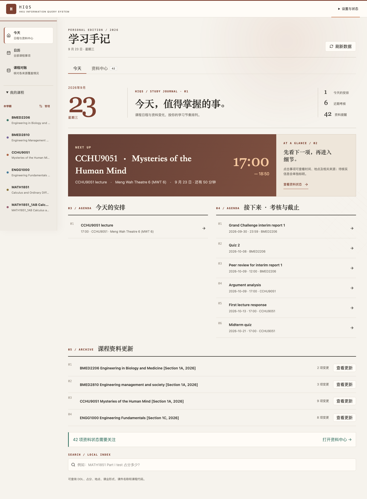

# HIQS — HKU Information Query System

> 将 Moodle、HKU SIS、课件和 syllabus 中的课程资料同步到本地，由 AI 整理为可查询的信息库与日历。

课程时间、DDL、评分方式和 Tutorial 安排通常分布在 timetable、Moodle、syllabus 与课程
公告中。查询一个事项可能需要交叉核对多个页面和文件。

HIQS 提供一个统一界面，让学生同步课程资料、查看重要日程、按主题查找课件，并直接调用
AI 查阅本地课程内容。重要信息同时保留来源与待确认状态，方便随时核对。

## 核心功能

- **一键集中课程资料**：在首页同步 Moodle、Student Center、SIS Course Information 与
  Class Planner，不再逐个网页查找课程信息。

- **跨课程可视化日历**：集中查看 Lecture、Tutorial、Lab、Assessment、DDL、地点、占分
  与提交要求，并以月、周、日视图掌握近期安排；也可添加和删除个人事件。

- **AI 课件智能分区**：按每门课程的周次、主题、Assessment 或学习用途整理课件，快速
  找到讲义、阅读、练习和复习材料。

- **一键复制 AI 提示词**：从首页、课程页或资料卡复制提示词，让 AI 查阅本地课件、回答
  问题、定位页码或 slide，并提供复习说明与学习指导。

- **启动时检查更新**：对照 GitHub 与本机版本显示更新状态，在源码工作树安全时直接
  fast-forward 更新并重建本地 App。



## 目录

- [核心功能](#核心功能)
- [UI 页面功能](#ui-页面功能)
- [快速开始](#快速开始)
- [使用方式](#使用方式)

## UI 页面功能

HIQS 将课程资料、重要日程、课件目录与原始来源集中在同一套本地界面中。

### 首页

- **今天**：查看下一项课程、当日安排、近期考核与课程资料更新。
- **资料中心**：开始同步并查看进度、待整理资料、OCR、来源冲突与更新记录。
- **复制 Agent 指令**：一键复制当前待处理课程和资料范围。
- **搜索与 Inbox**：搜索本地资料，并预览个人补充信息的写入变化。
- **课程管理**：添加或移除课程，并管理对应的日程和本地文件。
- **版本更新**：顶部按钮在每次启动时检查 GitHub；显示可更新、已是最新版本或检查失败。

### 日历页

- **月、周、日视图**：统一显示课程、Tutorial、Lab、Office Hour、Assessment 与 DDL。
- **课程筛选**：按课程或关键字缩小日程范围。
- **个人事件**：在日历中添加个人事项，并安全删除由用户创建的事件。
- **日期待确认**：没有可靠日期的课程活动仍保留在日历页，等待后续来源核实。
- **事项详情**：查看时间、地点、提交方式、字数、占分、要求、相关课件与证据来源。
- **课程变更**：显示假期、Reading Week、补课、取消、改时和教室变更。
- **导出 ICS**：将当前日程导入 Apple Calendar 等日历应用。

### 课程来源对账页

- **注册课程对照**：核对 Student Center、Moodle、官方课程资料与 Class Planner。
- **缺项提示**：标出尚未取得、等待 AI 整理或仍需确认的课程资料。
- **历史课程识别**：区分当前注册课程与本地保留的旧课程资料。

### 课程概览页

- **课程资料**：查看学期、教师、教学日期、课程综述与学习目标。
- **成绩构成**：汇总已确认的 Assessment、占分和子项目。
- **课件／活动切换**：在同一页面切换完整课件目录与课堂、作业、Quiz、考试及 DDL。
- **活动提示词**：从活动卡或详情复制提示词，查询活动要求及相关课件。

### 课件目录

- **AI 智能分区**：按课程自己的周次、主题、Assessment 或学习用途整理材料。
- **完整课件清单**：每份当前 Moodle 材料只出现一次，未分类资料会明确标示。
- **资料状态**：查看文件大小、文本副本、来源位置和本轮变化。
- **最近 Lecture 课件**：复制提示词，让 AI 找出最近课堂最相关的材料。
- **单份课件问答**：复制资料卡提示词，让 AI 总结内容并定位页码或 slide。

### 来源预览器

- **站内预览**：直接查看 PDF、图片及 DOCX/PPTX 的文本内容。
- **事实回溯**：从日程或课程信息打开对应证据和相关课件。
- **打开原文件**：继续访问本地原件或 Moodle 来源页面。

### 典型使用流程

1. 在首页选择 **开始同步**。
2. 同步完成后选择 **复制 Agent 整理指令**。
3. 让 Agent 整理新增或变化的课程资料。
4. 回到日历、课程概览和课件目录查看结果。
5. 需要深入学习时，从课程页或资料卡复制 AI 提示词继续提问。

## 快速开始

将以下提示词交给能够操作本地终端的 Agent：

```text
请从 https://github.com/Jerry6921/HSAS 下载最新的 HIQS 源码，并在合适的本地目录中完成安装。
如果目标目录已经是该仓库，请先检查工作树并以安全方式更新；保留所有用户数据与未提交修改。

定位包含 pyproject.toml 且项目名为 hku-information-query-system 的根目录，完整阅读
AGENTS.md 与 src/AI_Skills/SKILL.md，并遵循其中的项目边界。检查 Python 版本与系统依赖，
创建项目专用的 .venv，按照 requirements.lock 安装项目依赖，再安装匹配的 Playwright
Chromium。运行项目测试或必要的启动检查；如果当前系统是 macOS，运行
`./scripts/build_macos_app.sh` 并打开 `dist/HIQS.app`；其他系统启动 `hsas ui`。向我报告
安装位置、运行状态与访问方式。

HIQS 只绑定本机回环地址。Moodle、HKU Portal、SSO 与 MFA 登录由我在官方页面亲自完成；
请勿索取、读取或输出密码、验证码、Cookie、sesskey 或访问令牌。
```

### macOS 独立应用

完成源码安装后，在项目根目录运行：

```bash
./scripts/build_macos_app.sh
open dist/HIQS.app
```

生成的 `HIQS.app` 使用原生 macOS 窗口显示 Dashboard，不含浏览器地址栏，也无需输入本地
IP。应用会自动启动随机回环端口上的 HIQS 后端，并在退出时停止由它启动的进程；Moodle、
HKU Portal 与 SIS 登录仍会在官方浏览器窗口中完成。

这个轻量 App 绑定构建时的项目目录和 `.venv`，课程资料仍保存在当前用户的 Application
Support 目录。移动或重装源码环境后，重新运行构建脚本即可。构建过程仅产生本机 ad-hoc
签名的 `.app`，不会生成需要公开签名与 notarization 的 DMG。

App 每次启动会比较 GitHub `main` 与本机版本。自动更新只接受官方 `origin`、干净工作树
和 fast-forward；检测到未提交修改或分叉时会停止并提示交给 Agent 处理。更新源码和必要
依赖后会重建 `HIQS.app`，课程文件与 `information.json` 不在 Git 更新范围内。

### 前端开发

Dashboard 全部页面采用 React、TypeScript、shadcn/ui 风格组件与 Motion，日历由
FullCalendar 提供月、周、日视图；生产 bundle 已随 Python 包保存，普通运行不需要 Node。
修改 `ui/` 后使用 pnpm 重新构建：

```bash
cd ui
pnpm install --frozen-lockfile
pnpm run typecheck
pnpm run build
```

构建结果写入 `src/hsas/ui/web/modern-assets/`。Python UI 仅通过 `HIQSPort` 和现有本地 API
访问业务数据，前端依赖不会进入 CORE 或 MCP。

## 使用方式

### 让 Agent 整理新增信息

- 在首页完成课程同步。
- 选择 **复制 Agent 整理指令**。
- 将提示词粘贴给能够访问本机项目的 Agent。
- Agent 只整理本轮新增或变化的资料，并保留日期、占分、要求与来源。
- 完成后回到 HIQS 查看更新后的日历、课程概览与课件目录。

### 在 Agent 中向课程资料提问

- **课程问答**：询问考试日期、占分、范围、提交方式或相关课件。
- **最近 Lecture**：在课程页复制提示词，查找最近课堂最相关的材料。
- **单份课件阅读**：从资料卡复制提示词，总结重点、公式、要求与页码。
- **复习与学习指导**：让 Agent 解释概念、比较课程负担或整理复习方向。
- **来源核对**：答案保留相关来源，并明确待确认或互相冲突的信息。

### 连接支持 MCP 的 AI

HIQS 提供本地 stdio MCP Server。安装项目后运行：

```bash
hiqs-mcp
```

MCP 暴露经过统一 `HIQSPort` 的课程信息与 Schema、校验写入、资料查询、来源差异、ICS
日历、完整同步控制、OCR、Personal Inbox、来源登录／同步和课程管理工具。MCP 与浏览器
UI 不直接访问 Moodle、Repository 或 JSON 文件；二者都调用同一 CORE Port，因此来源
优先级、确认要求和数据校验不会在不同入口中重复实现。

### 在 Agent 中写入额外信息

- 将 Tutorial group、临时教室、个人提醒等信息告诉 Agent。
- 在 Inbox 查看新增或修改内容的预览。
- 确认后再写入课程信息和日历。

### 导出到 Apple Calendar

在日历页选择“导出 ICS”即可下载 `HIQS-calendar.ics`。该文件包含当前课程、Tutorial、
Assessment、DDL 与单次课程变更，可导入 Apple Calendar 及其他支持 iCalendar 的应用。

## 支持的课程文件

- PDF：提取文字并保留页码标记；扫描件自动进入本地 OCR 队列；
- DOCX：提取正文、页眉、页脚、脚注、尾注和批注；
- PPTX：提取每张 slide 的文字和 speaker notes，图片型课件自动进入本地 OCR 队列；
- Google Docs、Slides、Sheets：在当前登录会话有权限时尝试导出为 DOCX、PPTX、XLSX；
- 其他文档、图片、音视频、代码、Notebook 和压缩包：保留原文件与来源信息。

旧 `.doc`、`.ppt` 文件会完整下载；Open XML 文本提取流程适用于 DOCX/PPTX。
Google Workspace 返回登录页或权限页时，项目会标记为 external 并保留真实访问状态。

## 数据与增量更新

- **本地保存**：macOS 默认位于 `~/Library/Application Support/HSAS/`。
- **增量整理**：首次整理完整课程，之后只处理新增、修改或移除的资料。
- **保留旧资料**：更新失败时继续使用上一份有效课程资料。
- **明确确认**：个人补充信息和删除操作都需要用户确认。
- **可追溯**：重要日期、地点、占分与要求保留对应来源。

实现细节与数据结构见[架构与数据流](ARCHITECTURE.md)。

## 隐私与可靠性

- 课程文件、浏览器 profile、提取文本和 `information.json` 都在代码仓库之外；
- 密码、MFA、cookie、sesskey 和 access token 始终留在认证边界内；
- Moodle 页面与课件仅作为课程数据处理；
- 日期、地点、占分、要求和政策全部由明确证据支持；待确认值保持待确认；
- 冲突信息保留来源并标为 tentative；
- 每门课程在 staging 中完成下载、分析和校验后才原子发布；
- 同步中断或失败会保留上一份完整课程快照。

## 文档

- [架构与数据流](ARCHITECTURE.md)
- [Moodle Collector](MOODLE_COLLECTOR.md)
- [安全边界](SECURITY.md)
- [开发规范](CONTRIBUTING.md)
- [AI 写入协议](src/AI_Skills/references/information-write-protocol.md)

## License

HIQS 软件采用 [PolyForm Noncommercial License 1.0.0](LICENSE)。从 Moodle 下载的课程
资料继续适用其原有版权与使用条件，并由相应权利人的授权范围管理。

## 更新日志

本节只记录功能与界面版本，文档措辞和演示图片调整不单独列项。

### 2.8.0 · 2026-09-23

- Dashboard 全部可见页面迁移到 React、TypeScript、shadcn/ui 风格组件与 Motion，统一
  顶栏、侧栏、通知、课程概览、来源对账、详情窗口和课程管理交互；
- 日历升级为 FullCalendar 月、周、日视图，加入课程与关键字筛选、日期待确认列表、
  个人事件添加／删除、ICS 导出和活动 AI 提示词；
- 课程概览采用课件／活动双视图，课件与活动保留分类颜色、来源预览和 AI 查询入口；
- 首页整合同步工作台、资料闭环、Next Up、本地搜索、Inbox、OCR 与更新记录，并支持
  后台同步进度、安全取消及失败来源精确重试；
- MCP 补齐信息 Schema、校验写入、课程问答、课件检索、来源差异与 checkpoint、统一同步、
  OCR、Inbox、来源登录／同步和课程管理能力；
- 项目拆分为 CORE、MCP 与 UI 顶层模块，并以 APPLICATION Port 作为统一依赖边界；
  UI 和 MCP 不直接读写课程事实；
- Moodle 继续作为课程事实最高优先级，Student Center、SIS Course Information 与
  Class Planner 补充 Moodle 未说明的字段；`information.json` 保持唯一 canonical 数据源。

### 2.7.0 · 2026-09-18

- 新增源码驱动的原生 macOS `HIQS.app`，使用独立 WKWebView 窗口显示 Dashboard；
- App 自动启动和停止本地后端，外部课程来源与认证页面继续交给系统浏览器；
- 新增轻量本机构建脚本，不生成 DMG，也不需要把用户路径提交到仓库。
- 顶栏新增版本状态与安全更新按钮，启动时自动检查 GitHub 版本；
- AI 信息整理改为逐字段使用现有来源，缺少来源不阻塞写入，实际冲突才按 Moodle 优先级处理。

### 2.6.0 · 2026-09-18

- 课程概览新增最近 Lecture 相关课件提示词，每张课件卡新增定位与总结提示词；
- 课程课件改为 AI 自由命名栏位，并显示尚未写入栏位的待分类资料；
- 信息 Schema 新增课程级 `material_sections`，校验同一课件不会重复进入多个栏位。

### 2.5.0 · 2026-09-08

- 首页同步入口整合 Student Center 课程列表、Moodle 资料、SIS 官方课程信息与 Class Planner 课表；
- 登录集中在工作流起点，所有课程访问器共用同一浏览器 profile；
- 同步工作区简化为进度条、loading 标识、当前课程和取消操作；
- 新增 Student Center 注册课程快照、增量审阅批次与独立 checkpoint；
- 各来源在流程运行时检查会话状态，并在需要认证时打开对应官方登录页；
- 新增 HKU SIS Course Information 登录与同步，从 Student Center 课程代码拆分 Subject Area 和 Catalogue Number；
- 官方课程页保存为经过清洗的本地文本与 HTML 副本，并通过内容哈希形成独立增量审阅队列；
- AI 写入流程支持 SIS checkpoint；Moodle 课程资料作为最高优先级来源，冲突时保留双方证据并采用 Moodle 支持的值；
- 首页同步工作台新增来源状态、同步摘要与待整理差异；
- 侧栏新增课程数据库管理，可添加课程或删除课程、关联事项与本地课程文件；
- 动态质感扩展至首页、日历、资料条目与管理窗口；课程概览保留环境光并使用稳定的平面交互。

### 2.4.0 · 2026-09-07

- Dashboard 更新为以 Next Up、同步工作台、资料状态、本地搜索、个人 Inbox 和更新记录组成的首页；
- 加入 Canvas 水波反馈、鼠标环境光、卡片景深与动态质感开关，并完善深浅色和响应式布局；
- Moodle 同步改为后台任务，支持课程级进度、安全取消、会话实时校验及明确的完成、取消和失败状态；
- 月历与每日议程使用完整内容区域，事项详情改为可关闭的半透明预览窗口，外部 Moodle 来源在新标签页打开。

### 2.3.0 · 2026-09-07

- 接入 HKU Class Planner 登录与官方课表同步，保存经过隐私过滤的课程、班别、时间和地点；
- 新增稳定字段差异队列、逐字段审阅、陈旧批次校验和独立 checkpoint；
- 每周课程支持单次取消、改时、改教室和标题覆盖，并在月视图、每日议程及 Next Up 中统一呈现；
- 日历新增 ICS 导出，可导入 Apple Calendar 等支持 iCalendar 的应用。

### 2.2.0 · 2026-09-06

- 首页新增资料状态面板，集中显示等待 AI、OCR、Google 授权、日期确认和来源冲突；
- 新增扫描 PDF 与图片型 PPT 的本地 OCR 队列，并将结果写回可搜索文本副本；
- 新增个人补充信息 Inbox，以逐字段预览和确认流程写入 Tutorial group、临时教室与个人提醒。

### 2.1.0 · 2026-09-06

- 课程记录加入教学起止日期，日历新增月视图和 Apple Calendar 风格的每日议程；
- 日历活动可关联 Lecture、Tutorial、Notes、Exercises 与 Reading，并直接打开相关材料；
- 课程概览、本地搜索与来源预览器统一连接结构化事实和本地课件。

### 2.0.0 · 2026-09-05

- HIQS 重构为课程信息查询系统，由程序负责下载、Schema、原子写入和可视化，由 AI 负责资料阅读与归纳；
- 建立统一 `information.json`、增量 upsert、来源记录、change history 和 AI checkpoint；
- 支持完整保存 PDF、DOCX、PPTX 与 Google Workspace 导出文件，并按课程用途分类浏览。
