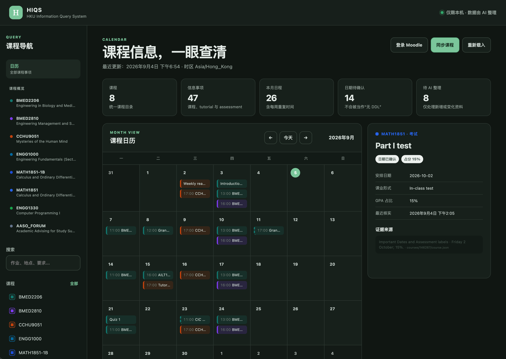
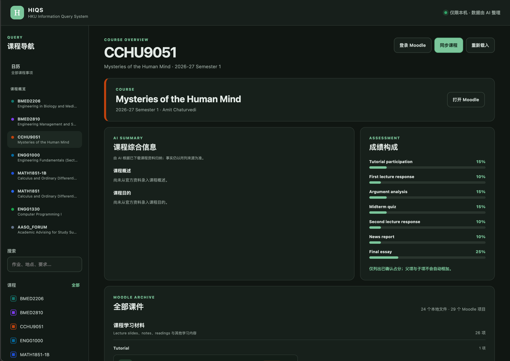
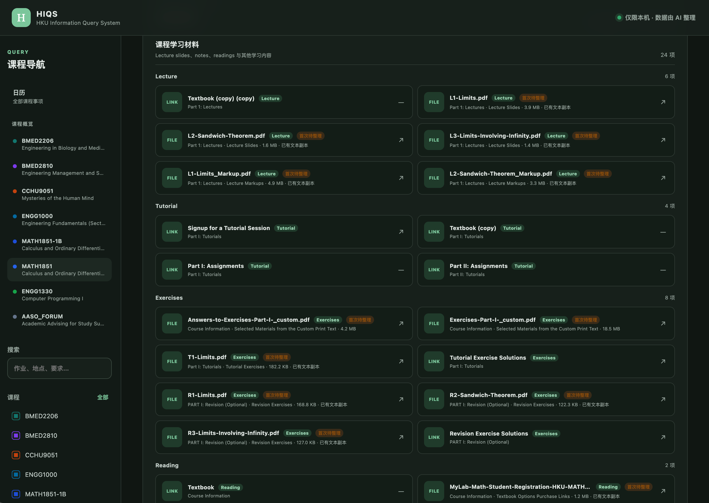

# HIQS — HKU Information Query System

> 把 Moodle、课件和 syllabus 里的课程资料收进本地，让 AI 整理成一个可查询的课程信息库与日历。

HIQS 的起点很朴素：一门课的时间在 timetable，DDL 在 Moodle，评分方式藏在 syllabus，
Tutorial 安排又可能出现在公告里。每一条信息都找得到，可真正需要时，总要重新翻一遍。

这个项目想做的，就是把这些零散资料收在一起。程序负责下载、数据结构、校验和
可视化；AI 负责真正阅读资料、归纳课程信息。你得到的是一个知道资料来自哪里、哪些内容
等待补充、最近哪里有变化的本地课程信息库。

## 能做什么

- 登录 HKU Moodle，并同步当前账号有权访问的课程与附件；
- 把 PDF、DOCX、PPTX 等文件保存在本地，并生成 AI 可检索的文本副本；
- 让 AI 整理课程、Tutorial、Assessment、DDL、形式、要求、占分和证据来源；
- 用月历展示课程时间、Tutorial、Lab、Office hour 和截止日期；
- 从左侧选择课程，查看 AI 总结的课程概述、课程目的和已确认成绩构成；
- 浏览全部 Moodle 项目，并区分 Lecture、Tutorial、Notes、Exercises、Reading、
  Assessment、Course Information、Announcements 等类型；
- 标记新增或更新的课件，让 AI 只重新阅读发生变化的内容。
- 通过本地 RAG 同时检索结构化课程事实和课件原文，让 AI 带出处回答问题。

HIQS 专注于提供课程事实、课件证据和日历查询。学生可以在 AI 对话中比较 DDL、理解要求，
并据此自主制定学习计划；AI 建议作为独立的对话内容，采纳与记录方式由学生决定。

## 界面一览

日历把课程、Tutorial、Assessment 和 DDL 放回同一条时间线上。点击事项后，日期、形式、
占分和证据来源都在右侧直接展开，并准确显示对应的 Moodle 页面或本地资料。



切换到一门课程后，可以一起查看课程综述、课程目的和已经确认的成绩构成。综述由 AI 根据
下载到本地的官方资料归纳；资料还没说清楚的地方，会诚实地留空。



课件会从下载列表整理成清晰的资料库。HIQS 会保留 Moodle 原有上下文，并进一步整理为
Lecture、Tutorial、Notes、Exercises、Reading 等类别；刚同步、尚待 AI 阅读的文件会有
清楚的标记。



## 工作流

```text
Moodle
  ↓
Collector 下载文件、保存来源并生成文本副本
  ↓
Change Queue 标出首次全量或后续增量变化
  ↓
AI 阅读待处理文件，归纳课程事实与课程综述
  ↓
HIQS 校验并增量写入 information.json
  ↓
Dashboard 映射为日历、课程概览与课件目录
```

Collector 准确记录资料取得、同步异常与内容变化，课件理解由 AI 完成。
所有可查询事实都必须由 AI 或用户依据来源写入，并通过严格 Schema 校验。

## 快速开始

### 要求

- macOS 或 Linux；
- Python 3.11 或更高版本；
- 可访问 HKU Moodle 的账号；
- 用户本人完成 HKU SSO 和 MFA。

### 安装

```bash
git clone https://github.com/Jerry6921/HSAS.git
cd HSAS
python3 -m venv .venv
source .venv/bin/activate
python -m pip install -c requirements.lock -e .
playwright install chromium
```

CLI 为兼容旧版继续使用 `hsas`，产品名称已经改为 HIQS。

### 登录与同步

```bash
hsas login
hsas sync-courses
hsas list-status
```

`hsas login` 会打开浏览器。密码与 MFA 始终由用户在 HKU 页面中输入；AI 仅接触同步后的
课程资料与经过清理的来源信息。

同步单门课程时可传入 Moodle course ID 或同源课程 URL：

```bash
hsas sync-courses 138907
```

### 让 AI 整理资料

```bash
hsas changes list
hsas changes show --output pending-changes.json
hsas information template information-update.json
hsas information validate information-update.json
hsas information apply information-update.json \
  --changes pending-changes.json \
  --confirmed
```

AI 应先读取 `pending-changes.json`。首次同步的课程会列出全部文件；完成首次整理后，后续
批次只包含新增、修改或删除的活动与课件，以及当前 `course.json`。如果批次生成后 Moodle
又被同步，旧批次会被拒绝，避免错误跳过新变化。

若 AI 阅读后确认课程事实保持一致：

```bash
hsas changes acknowledge pending-changes.json \
  --confirmed \
  --reviewed-no-information-change
```

## Dashboard

```bash
hsas ui
```

Dashboard 只绑定本机 `127.0.0.1`，提供三个核心入口。

### 日历

- 月视图展示一次性日期和每周重复课程；
- 支持课程筛选和全文搜索；
- 点击事项查看 DDL、地点、形式、提交方式、字数、占分、要求、警告与证据；
- 日期待确认的事项集中显示，持续提醒用户核实 DDL。

### 课程概览

- 左侧选择课程；
- 查看 AI 基于官方资料归纳的课程概述与课程目的；
- 查看已确认 Assessment 占分，父级与子级按照官方评分结构分别呈现；
- 即使 AI 尚未首次整理，已经下载的 Moodle 课件仍然可以浏览。

### 课件目录

课件先分为“课程学习材料”和“课程信息”，再依据 Moodle activity 类型、标题、section 与
文件名细分为 Lecture、Tutorial、Notes、Exercises、Reading、Assessment 等类别。本轮
新增或更新的文件会显示待整理标记，本地文件可以从 Dashboard 直接打开。

## AI 如何总结课程

首次全量整理时，AI 可根据 syllabus、course introduction、assessment information 等
官方资料填写：

- `overview`：简洁的课程综述；
- `objectives`：资料明确支持的课程目的；
- `sources`：可供用户复查的文件、页码或链接。

这些内容依据课程资料归纳。来源有限时字段保持为空；
后续只有相关课件发生变化时才重新总结。

## 用 RAG 向课程资料提问

HIQS 的 RAG 保持在本地运行，专门为每次提问准备证据：精确日期、课程时间和占分来自经过
校验的 `information.json`，课程内容与详细
要求来自 PDF、DOCX、PPTX 的文本副本。

```bash
hsas query "MATH1851 Part I test 几时、占几分，范围是什么？" \
  --course COURSE_ID
```

命令会输出机器可读的 RAG context，其中包括：

- 匹配的课程与日历事项；
- 已记录的日期、形式、占分、要求、状态与来源；
- 相关课件段落、文件名、Moodle activity，以及可用的页码或 slide 标记；
- 数据库时效、待补资料与空检索结果警告。

课程文件保留在本地，`hsas query` 以模型无关的方式生成检索结果。项目内置的
[`hiqs-course-information` AI Skill](src/AI_Skills/SKILL.md) 会指导兼容的 AI 先运行
`hsas query`，再只根据返回证据回答并附上出处。当前检索结合结构化事实匹配与本地
BM25 风格全文检索；以后即使加入 embeddings，也应继续按文件哈希增量更新并保留同样的
来源边界。

学生当然可以继续问：“根据这些确认过的 DDL，我该怎样安排这一周？”AI 可以帮助比较、
提出方案和反复修改；计划由学生自己决定，并作为课程事实库之外的独立内容保存与执行。

## 支持的课程文件

- PDF：提取文字并保留页码标记；扫描件会提示可能需要 OCR；
- DOCX：提取正文、页眉、页脚、脚注、尾注和批注；
- PPTX：提取每张 slide 的文字和 speaker notes；
- Google Docs、Slides、Sheets：在当前登录会话有权限时尝试导出为 DOCX、PPTX、XLSX；
- 其他文档、图片、音视频、代码、Notebook 和压缩包：保留原文件与来源信息。

旧 `.doc`、`.ppt` 文件会完整下载；Open XML 文本提取流程适用于 DOCX/PPTX。
Google Workspace 返回登录页或权限页时，项目会标记为 external 并保留真实访问状态。

查看与搜索本地课件：

```bash
hsas materials list
hsas materials list --course COURSE_ID
hsas materials search "assignment requirements" --course COURSE_ID
```

## 数据与增量更新

默认数据位于平台应用数据目录。macOS 沿用旧版路径以避免升级时丢失资料：

```text
~/Library/Application Support/HSAS/
├── browser-profile/
├── resources/
│   ├── information.json
│   ├── ai-state/change-checkpoint.json
│   └── courses/COURSE_ID/
│       ├── course.json
│       ├── files/
│       ├── analysis/text/
│       ├── changes/history/
│       └── raw/
└── state/
```

可用 `HSAS_DATA_DIR` 或全局 `--resources` 覆盖数据位置。

`information.json` 是日历与课程概览的唯一结构化事实来源。写入采用增量 upsert：相同
`course_id` 或 `item_id` 被完整更新，新 ID 被追加，未出现在本次更新中的记录会保留。
上一份有效数据库会在校验失败时继续保留；删除操作始终需要显式流程。

## 隐私与可靠性

- 课程文件、浏览器 profile、提取文本和 `information.json` 都在代码仓库之外；
- 密码、MFA、cookie、sesskey 和 access token 始终留在认证边界内；
- Moodle 页面与课件仅作为课程数据处理；
- 日期、地点、占分、要求和政策全部由明确证据支持；待确认值保持待确认；
- 冲突信息保留来源并标为 tentative；
- 每门课程在 staging 中完成下载、分析和校验后才原子发布；
- 同步中断或失败会保留上一份完整课程快照。

## 常用命令

```text
hsas login                 登录 Moodle
hsas sync-courses          同步全部课程
hsas sync-courses COURSE   同步指定课程
hsas list-status           查看资料与待整理状态
hsas changes list          查看增量整理摘要
hsas changes show          导出 AI 应阅读的范围
hsas information show      查看结构化信息库
hsas materials list        查看全部本地文件
hsas materials search      搜索文本副本
hsas query                 为 AI 检索课程事实与课件证据
hsas ui                    打开本地 Dashboard
```

## 文档

- [架构与数据流](ARCHITECTURE.md)
- [Moodle Collector](MOODLE_COLLECTOR.md)
- [安全边界](SECURITY.md)
- [开发规范](CONTRIBUTING.md)
- [AI 写入协议](src/AI_Skills/references/information-write-protocol.md)

## License

HIQS 软件采用 [PolyForm Noncommercial License 1.0.0](LICENSE)。从 Moodle 下载的课程
资料继续适用其原有版权与使用条件，并由相应权利人的授权范围管理。

## 2.0 主要变化

- 从学习辅助系统重构为课程信息查询系统，移除 Planner、优先级、Profile 和执行记录；
- 建立“程序下载与校验、AI 阅读与写入”的清晰分工，以 AI 资料阅读取代自动 Assessment Parser；
- 新增统一 `information.json`、严格 Schema、增量 upsert 和来源记录；
- 完整保存 Moodle 课件，并支持 PDF、DOCX、PPTX 和 Google Workspace 导出文件；
- 新增 change history 与 AI checkpoint，只重新整理发生变化的内容；
- 新增课程日历、课程概览、AI 课程摘要、Assessment 占分和详细课件分类；
- Dashboard 新增 Moodle 登录、同步、本地课件打开和待 AI 整理状态。
