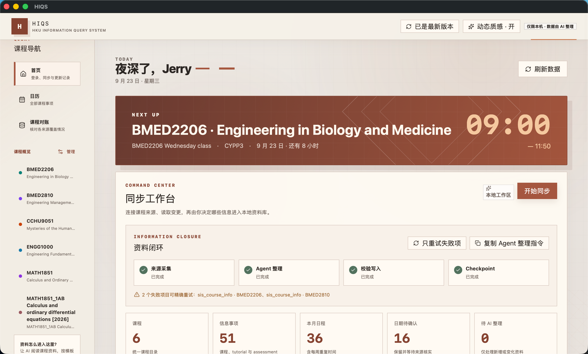

# HIQS — HKU Information Query System

> 将 Moodle、HKU SIS、课件和 syllabus 中的课程资料同步到本地，由 AI 整理为可查询的信息库与日历。

课程时间、DDL、评分方式和 Tutorial 安排通常分布在 timetable、Moodle、syllabus 与课程
公告中。查询一个事项可能需要交叉核对多个页面和文件。

HIQS 将这些资料统一保存到本地。程序负责下载、数据结构、校验和可视化；AI 负责阅读资料
并归纳课程信息。系统保留信息来源、待补字段和 Moodle 内容变化记录。



## 目录

- [UI 页面功能](#ui-页面功能)
- [快速开始](#快速开始)
- [使用方式](#使用方式)

## UI 页面功能

HIQS 的界面由首页、日历和课程概览组成，并将课程资料、结构化事实与原始来源连接在同一套
本地视图中。

### 首页

首页集中呈现近期事项、外部课程来源和本地信息库状态。Next Up 卡片显示下一项课程活动或
DDL 的时间、地点与倒计时；同步工作台通过一个“开始同步”入口运行完整课程数据流程，并
通过进度条、loading 标识和当前课程名称显示运行状态。流程先用统一浏览器 profile 完成
HKU Portal 登录并建立来源会话，再从 HKU SIS Student Center 取得当前学期注册课程，按课程
确定采集范围。随后 Moodle 文件、SIS Course Information 与 HKU Class Planner 课表并发同步，
首页以一条聚合进度显示三个来源的完成情况。

Student Center 课程名单直接提供课程代码，例如把 `BMED2206` 拆为 Subject Area `BMED`
与 Catalogue Number `2206`。系统逐门取得 SIS 课程页面，保存经过清洗的可读副本与
内容哈希；AI 以该官方页面作为重叠课程事实的最高优先级来源。SIS 与 Class Planner 共享
HKU Portal 浏览器 profile，SIS 登录窗口同时承接可能出现的一次图形验证。

课程数、信息事项、本月日程、待确认日期和待 AI 整理数量构成首页摘要。资料状态进一步汇总
OCR、Google 授权与来源冲突；本地搜索、个人补充信息 Inbox 和更新记录分别承担资料检索、
补充信息预览以及 Moodle 变化审阅。

侧栏课程管理可直接向 `information.json` 添加课程，也可删除课程、关联事项与本地课程文件。
删除的文件先转移到本机回收目录；再次同步 Moodle 时仍可重新取得可访问的课程资料。

### 日历页

日历页提供月视图与 Apple Calendar 风格的每日议程，统一呈现课程、Tutorial、Lab、Office
hour、Assessment 与 DDL。课程筛选和侧栏搜索控制可见范围；事项详情以半透明窗口展示日期
状态、地点、课业形式、提交方式、字数、占分、要求、警告、相关材料与证据来源。

每日议程按照开始与结束时间布置活动，并为日期型事项保留全天区域。每周课程支持假期与
Reading Week 排除、补课日期，以及单次取消、改时、改教室和标题变更。月视图、每日议程与
ICS 导出共用同一组课程例外，可导入 Apple Calendar 等支持 iCalendar 的应用。

### 课程概览页

课程概览页按课程组织名称、学期、教学起止日期、教师、课程综述与课程目的。成绩构成区域
展示已确认的 Assessment、占分及父子结构；课件区域汇总对应课程的全部 Moodle 学习材料和
课程信息。

### 课件目录

课件目录先区分课程学习材料与课程信息，再细分为 Lecture、Tutorial、Notes、Exercises、
Reading、Assessment、Course Information 与 Announcements。资料卡保留 Moodle section、
activity、文件大小、文本副本状态和本轮变化标记。

### 来源预览器

来源预览器在 Dashboard 内显示 PDF、图片以及 DOCX/PPTX 的文本副本。事项中的“相关学习
材料”和“证据来源”共用这一视图。预览底部保留本地原文件与 Moodle 来源链接，使结构化
事实能够追溯到具体页面、页码或 slide。

### 同步与整理工作流

```text
HKU SIS Student Center
  ↓
取得当前学期注册课程，保存原始可读文本与课程名单快照
  ↓
`BrowserSessionBroker` 打开一个认证 context，并发运行三个独立来源页面
  ├─ Moodle：按课程同步文件与文本副本
  ├─ SIS Course Information：按课程同步最高优先级官方页面
  └─ HKU Class Planner：同步上课时间、班别和地点
  ↓
各来源生成独立增量审阅队列
  ↓
AI 阅读本轮新增或变化资料
  ↓
HIQS 校验并增量写入 information.json，同时推进对应 checkpoint
  ↓
Dashboard 映射为日历、课程概览与课件目录

Moodle
  ↓
Collector 下载文件、保存来源并生成文本副本
  ↓
Change Queue 标出首次全量或后续增量变化
  ↓
OCR Queue 识别扫描 PDF 与图片型 PPT
  ↓
AI 阅读待处理文件，归纳课程事实与课程综述
  ↓
HIQS 校验并增量写入 information.json
  ↓
Dashboard 映射为日历、课程概览与课件目录

HKU Class Planner
  ↓
隐私过滤的官方课表快照与独立差异队列
  ↓
AI 核对班别、时间、地点和单次课表例外
  ↓
经校验写入 information.json 后推进 Class Planner checkpoint

Student Center 课程代码
  ↓
HKU SIS Course Information 读取官方课程页面
  ↓
清洗可见正文、保存哈希并生成独立差异队列
  ↓
AI 优先核对课程概述、目标、评分、政策与推荐阅读
  ↓
经校验写入 information.json 后推进 SIS checkpoint
```

Collector 记录资料取得、同步异常与内容变化，课件内容由 AI 读取。所有可查询事实由 AI
或用户依据来源写入，并通过 Schema 校验。

## 快速开始

将以下提示词交给能够操作本地终端的 Agent：

```text
请从 https://github.com/Jerry6921/HSAS 下载最新的 HIQS 源码，并在合适的本地目录中完成安装。
如果目标目录已经是该仓库，请先检查工作树并以安全方式更新；保留所有用户数据与未提交修改。

定位包含 pyproject.toml 且项目名为 hku-information-query-system 的根目录，完整阅读
AGENTS.md 与 src/AI_Skills/SKILL.md，并遵循其中的项目边界。检查 Python 版本与系统依赖，
创建项目专用的 .venv，按照 requirements.lock 安装项目依赖，再安装匹配的 Playwright
Chromium。运行项目测试或必要的启动检查，确认环境可用后启动 `hsas ui`，让 Dashboard
自动在本机打开，并向我报告安装位置、运行状态与访问地址。

HIQS 只绑定本机回环地址。Moodle、HKU Portal、SSO 与 MFA 登录由我在官方页面亲自完成；
请勿索取、读取或输出密码、验证码、Cookie、sesskey 或访问令牌。
```

## 使用方式

### 让 Agent 整理新增信息

每次在首页完成课程同步后，可以直接告诉 Agent：“请整理 HIQS 本次新增或变化的课程资料。”
Agent 会读取 Student Center、Moodle、官方课程信息和课表的待审阅队列与 checkpoint：首次整理覆盖该课程的全部资料，
后续只阅读新增、修改或删除的项目及相关课程索引，并在需要时先处理 OCR 队列。

Agent 会把有来源支持的新课程事实、日历事项和材料关联整理成更新预览。确认写入后，HIQS
完成 Schema 与课程引用校验、原子更新本地信息库，并推进对应 checkpoint；没有产生新事实的
已审阅批次也会被记录，下一次无需重复阅读。

### 在 Agent 中向课程资料提问

启动 HIQS 后，直接在 Agent 对话中提出自然语言问题，例如询问某次考试的日期、占分、
范围与相关课件。Agent 会按照项目 Skill 检索本地 `information.json` 和课程文本副本，
组合结构化事实与相关材料，并在答案中标明来源、待确认字段和冲突信息。

学生也可以请 Agent 比较已经确认的 DDL 与课程时间，在对话中自行调整学习安排。

### 在 Agent 中写入额外信息

把 Tutorial group、临时教室、个人提醒或其他补充信息直接告诉 Agent。Agent 会将内容整理
为待写入草稿，并在 Inbox 中展示记录动作与逐字段变化。用户确认预览后，HIQS 再通过同一套
Schema、课程引用和时间规则完成校验，并原子更新本地信息库。

### 导出到 Apple Calendar

在日历页选择“导出 ICS”即可下载 `HIQS-calendar.ics`。该文件包含当前课程、Tutorial、
Assessment、DDL 与单次课程变更，可导入 Apple Calendar 及其他支持 iCalendar 的应用。

## 支持的课程文件

- PDF：提取文字并保留页码标记；扫描件自动进入本地 OCR 队列；
- DOCX：提取正文、页眉、页脚、脚注、尾注和批注；
- PPTX：提取每张 slide 的文字和 speaker notes，图片型课件自动进入本地 OCR 队列；
- Google Docs、Slides、Sheets：在当前登录会话有权限时尝试导出为 DOCX、PPTX、XLSX；
- 其他文档、图片、音视频、代码、Notebook 和压缩包：保留原文件与来源信息。

旧 `.doc`、`.ppt` 文件会完整下载；Open XML 文本提取流程适用于 DOCX/PPTX。
Google Workspace 返回登录页或权限页时，项目会标记为 external 并保留真实访问状态。

## 数据与增量更新

默认数据位于平台应用数据目录。macOS 沿用旧版路径，以保持升级前后的资料连续性：

```text
~/Library/Application Support/HSAS/
├── browser-profile/  # Moodle、HKU Portal、SIS 与 Class Planner 共享会话
├── resources/
│   ├── information.json
│   ├── ai-state/change-checkpoint.json
│   ├── ai-state/personal-inbox.json
│   ├── sis-enrollment/latest.json
│   ├── sis-enrollment/latest.txt
│   ├── sis-enrollment/review-checkpoint.json
│   ├── class-planner/latest.json
│   ├── class-planner/review-checkpoint.json
│   ├── sis-course-info/latest.json
│   ├── sis-course-info/review-checkpoint.json
│   ├── sis-course-info/courses/COURSE_CODE/latest.txt
│   └── courses/COURSE_ID/
│       ├── course.json
│       ├── files/
│       ├── analysis/text/
│       ├── changes/history/
│       └── raw/
└── state/
```

`information.json` 是日历与课程概览的唯一结构化事实来源。写入采用增量 upsert：相同
`course_id` 或 `item_id` 被完整更新，新 ID 被追加，未出现在本次更新中的记录会保留。
上一份有效数据库会在校验失败时继续保留；删除操作始终需要显式流程。

升级产生的旧 change history 会在读取时经过兼容适配。旧版 `assessment` 与 `weight` 变化
会作为通用 activity 变化信号参与 checkpoint 筛选，历史 JSON 文件保持原样。

## 隐私与可靠性

- 课程文件、浏览器 profile、提取文本和 `information.json` 都在代码仓库之外；
- 密码、MFA、cookie、sesskey 和 access token 始终留在认证边界内；
- Moodle 页面与课件仅作为课程数据处理；
- 日期、地点、占分、要求和政策全部由明确证据支持；待确认值保持待确认；
- 冲突信息保留来源并标为 tentative；
- 每门课程在 staging 中完成下载、分析和校验后才原子发布；
- 同步中断或失败会保留上一份完整课程快照。

## 文档

- [架构与数据流](ARCHITECTURE.md)
- [Moodle Collector](MOODLE_COLLECTOR.md)
- [安全边界](SECURITY.md)
- [开发规范](CONTRIBUTING.md)
- [AI 写入协议](src/AI_Skills/references/information-write-protocol.md)

## License

HIQS 软件采用 [PolyForm Noncommercial License 1.0.0](LICENSE)。从 Moodle 下载的课程
资料继续适用其原有版权与使用条件，并由相应权利人的授权范围管理。

## 更新日志

本节只记录功能与界面版本，文档措辞和演示图片调整不单独列项。

### 2.5.0 · 2026-09-08

- 首页同步入口整合 Student Center 课程列表、Moodle 资料、SIS 官方课程信息与 Class Planner 课表；
- 登录集中在工作流起点，所有课程访问器共用同一浏览器 profile；
- 同步工作区简化为进度条、loading 标识、当前课程和取消操作；
- 新增 Student Center 注册课程快照、增量审阅批次与独立 checkpoint；
- 各来源在流程运行时检查会话状态，并在需要认证时打开对应官方登录页；
- 新增 HKU SIS Course Information 登录与同步，从 Student Center 课程代码拆分 Subject Area 和 Catalogue Number；
- 官方课程页保存为经过清洗的本地文本与 HTML 副本，并通过内容哈希形成独立增量审阅队列；
- AI 写入流程支持 SIS checkpoint，并将明确重叠的 SIS 课程事实设为最高来源优先级；
- 首页同步工作台新增来源状态、同步摘要与待整理差异；
- 侧栏新增课程数据库管理，可添加课程或删除课程、关联事项与本地课程文件；
- 动态质感扩展至首页、日历、资料条目与管理窗口；课程概览保留环境光并使用稳定的平面交互。

### 2.4.0 · 2026-09-07

- Dashboard 更新为以 Next Up、同步工作台、资料状态、本地搜索、个人 Inbox 和更新记录组成的首页；
- 加入 Canvas 水波反馈、鼠标环境光、卡片景深与动态质感开关，并完善深浅色和响应式布局；
- Moodle 同步改为后台任务，支持课程级进度、安全取消、会话实时校验及明确的完成、取消和失败状态；
- 月历与每日议程使用完整内容区域，事项详情改为可关闭的半透明预览窗口，外部 Moodle 来源在新标签页打开。

### 2.3.0 · 2026-09-07

- 接入 HKU Class Planner 登录与官方课表同步，保存经过隐私过滤的课程、班别、时间和地点；
- 新增稳定字段差异队列、逐字段审阅、陈旧批次校验和独立 checkpoint；
- 每周课程支持单次取消、改时、改教室和标题覆盖，并在月视图、每日议程及 Next Up 中统一呈现；
- 日历新增 ICS 导出，可导入 Apple Calendar 等支持 iCalendar 的应用。

### 2.2.0 · 2026-09-06

- 首页新增资料状态面板，集中显示等待 AI、OCR、Google 授权、日期确认和来源冲突；
- 新增扫描 PDF 与图片型 PPT 的本地 OCR 队列，并将结果写回可搜索文本副本；
- 新增个人补充信息 Inbox，以逐字段预览和确认流程写入 Tutorial group、临时教室与个人提醒。

### 2.1.0 · 2026-09-06

- 课程记录加入教学起止日期，日历新增月视图和 Apple Calendar 风格的每日议程；
- 日历活动可关联 Lecture、Tutorial、Notes、Exercises 与 Reading，并直接打开相关材料；
- 课程概览、本地搜索与来源预览器统一连接结构化事实和本地课件。

### 2.0.0 · 2026-09-05

- HIQS 重构为课程信息查询系统，由程序负责下载、Schema、原子写入和可视化，由 AI 负责资料阅读与归纳；
- 建立统一 `information.json`、增量 upsert、来源记录、change history 和 AI checkpoint；
- 支持完整保存 PDF、DOCX、PPTX 与 Google Workspace 导出文件，并按课程用途分类浏览。
