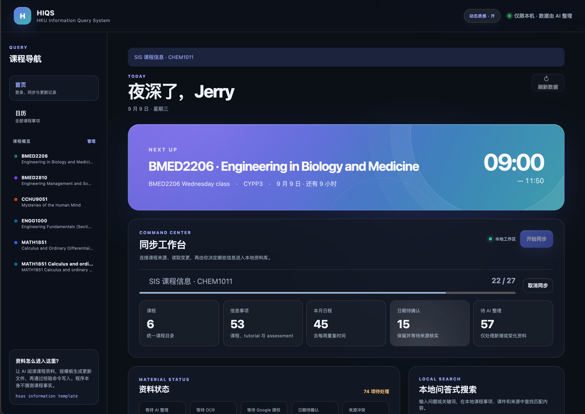

# HIQS — HKU Information Query System

> 将 Moodle、课件和 syllabus 中的课程资料同步到本地，由 AI 整理为可查询的信息库与日历。

课程时间、DDL、评分方式和 Tutorial 安排通常分布在 timetable、Moodle、syllabus 与课程
公告中。查询一个事项可能需要交叉核对多个页面和文件。

HIQS 将这些资料统一保存到本地。程序负责下载、数据结构、校验和可视化；AI 负责阅读资料
并归纳课程信息。系统保留信息来源、待补字段和 Moodle 内容变化记录。

## 页面功能与使用方式

HIQS 的侧栏由首页、日历和课程概览组成。课程资料、结构化事实与来源预览均从这些页面进入。
学生也可以把本地检索结果交给 AI，在对话中比较 DDL、理解要求并制定自己的学习安排。

### 首页：同步、处理资料与查看更新

首页承担应用入口的功能：

1. 点击“登录 Moodle”，由学生本人完成 HKU SSO 与 MFA；
2. 点击“同步课程”，下载当前账号可访问的课程页面和附件，并在首页查看进度或请求安全取消；
3. 查看课程数、信息事项、本月日程、待确认日期与待 AI 整理数量；
4. 在“资料状态”中集中查看等待 AI 整理、等待 OCR、等待 Google 授权、日期待确认和来源冲突；
5. 通过“OCR 队列”批量识别扫描 PDF 与图片型 PPT，并把识别结果写回可搜索文本副本；
6. 在“个人补充信息”中逐字段预览 AI 准备的 Tutorial group、临时教室与个人提醒草稿，确认后写入；
7. 在“本地问答式搜索”中输入课程代码、事项名称、DDL、地点或课件关键词；
8. 在“更新记录”中查看 Moodle 项目的新增、修改与删除，以及等待 AI 审阅的资料。
9. 通过 HKU Portal 登录 Class Planner，同步官方课程、班别、上课时间和地点，并查看带 checkpoint 的逐字段差异队列。



### 日历页：从月份进入当天安排

月视图统一呈现课程、Tutorial、Lab、Office hour、Assessment 与 DDL。课程筛选器可以控制
日历中显示的课程，侧栏搜索可以进一步筛选事项。点击月历中的事项会在右侧显示日期状态、
地点、课业形式、提交方式、字数、占分、要求、警告和证据来源。日历工具栏可导出
`HIQS-calendar.ics`，用于导入 Apple Calendar 等支持 iCalendar 的应用。

点击日期数字或“日”按钮可进入每日议程。日视图采用纵向时间轴，按照开始与结束时间放置
活动；日期型事项显示在全天区域。活动卡片会标出关联材料数量，点击后可在右侧打开 AI 配对
的 Lecture、Notes、Tutorial、Exercises 与 Reading。顶部箭头在月视图切换月份，在日视图
切换前后一天。每周活动支持假期与 Reading Week 排除、补课日期，以及单次取消、改时、
改教室和标题变更；月视图、每日议程与 ICS 导出共用同一组例外规则。

### 课程概览页：理解一门课程的整体结构

从左侧“课程概览”选择课程后，页面显示课程名称、学期、教学起止日期、教师、AI 归纳的
课程综述与课程目的。成绩构成区域列出已确认的 Assessment 及占分，并按照资料中的父级与
子级结构展示。页面下方汇总该课程的 Moodle 资料，可直接进入具体课件。

### 课件目录：按用途浏览下载资料

课程资料先分为“课程学习材料”和“课程信息”，再细分为 Lecture、Tutorial、Notes、
Exercises、Reading、Assessment、Course Information 与 Announcements。每张资料卡保留
Moodle section、activity、文件大小、文本副本状态和本轮变化标记。点击本地资料卡即可进入
来源预览器。

### 来源预览器：核对课程事实与打开原文

来源预览器在 Dashboard 内显示 PDF、图片以及 DOCX/PPTX 的文本副本。事项中的“相关学习
材料”和“证据来源”共用这一入口。预览底部提供本地原文件与 Moodle 来源链接，方便从
结构化事实回到具体页面、页码或 slide 进行核对。

## 工作流

```text
Moodle
  ↓
Collector 下载文件、保存来源并生成文本副本
  ↓
Change Queue 标出首次全量或后续增量变化
  ↓
OCR Queue 识别扫描 PDF 与图片型 PPT
  ↓
AI 阅读待处理文件，归纳课程事实与课程综述
  ↓
HIQS 校验并增量写入 information.json
  ↓
Dashboard 映射为日历、课程概览与课件目录

HKU Class Planner
  ↓
隐私过滤的官方课表快照与独立差异队列
  ↓
AI 核对班别、时间、地点和单次课表例外
  ↓
经校验写入 information.json 后推进 Class Planner checkpoint
```

Collector 记录资料取得、同步异常与内容变化，课件内容由 AI 读取。所有可查询事实由 AI
或用户依据来源写入，并通过 Schema 校验。

## 快速开始

将以下提示词交给能够操作本地终端的 Agent：

```text
请从 https://github.com/Jerry6921/HSAS 下载最新的 HIQS 源码，并在合适的本地目录中完成安装。
如果目标目录已经是该仓库，请先检查工作树并以安全方式更新；保留所有用户数据与未提交修改。

定位包含 pyproject.toml 且项目名为 hku-information-query-system 的根目录，完整阅读
AGENTS.md 与 src/AI_Skills/SKILL.md，并遵循其中的项目边界。检查 Python 版本与系统依赖，
创建项目专用的 .venv，按照 requirements.lock 安装项目依赖，再安装匹配的 Playwright
Chromium。运行项目测试或必要的启动检查，确认环境可用后启动 `hsas ui`，让 Dashboard
自动在本机打开，并向我报告安装位置、运行状态与访问地址。

HIQS 只绑定本机回环地址。Moodle、HKU Portal、SSO 与 MFA 登录由我在官方页面亲自完成；
请勿索取、读取或输出密码、验证码、Cookie、sesskey 或访问令牌。
```

## 启动 Dashboard

```bash
hsas ui
```

Dashboard 绑定本机 `127.0.0.1`，侧栏提供首页、日历和各课程概览。
请通过 `hsas ui` 启动，并使用终端显示的 `http://127.0.0.1:...` 地址访问；本地 HTTP
服务为搜索、来源预览、同步和 Moodle 跳转提供数据接口。

macOS App 会自动完成上述启动过程，并在 WKWebView 窗口中加载同一套界面。HTTP 服务仍然
只存在于本机回环接口，窗口不显示地址栏；外部 Moodle 链接交给系统默认浏览器打开。

## AI 如何总结课程

首次全量整理时，AI 可根据 syllabus、course introduction、assessment information 等
官方资料填写：

- `overview`：课程综述；
- `objectives`：资料明确支持的课程目的；
- `starts_on` / `ends_on`：课程在该学期的教学起止日期；
- `sources`：可供用户复查的文件、页码或链接。

AI 还可在日历事项的 `materials` 中关联相应 Lecture、Notes、Tutorial、Exercises 与
Reading。用户从月历或每日议程打开事项后，可直接预览相关课件原文或文本副本。

这些内容依据课程资料归纳。来源有限时字段保持为空；
后续只有相关课件发生变化时才重新总结。

## 用 RAG 向课程资料提问

HIQS 的 RAG 在本地运行，并为每次提问组合两类证据：精确日期、课程时间和占分来自经过
校验的 `information.json`，课程内容与详细
要求来自 PDF、DOCX、PPTX 的文本副本。

```bash
hsas query "MATH1851 Part I test 几时、占几分，范围是什么？" \
  --course COURSE_ID
```

命令会输出机器可读的 RAG context，其中包括：

- 匹配的课程与日历事项；
- 已记录的日期、形式、占分、要求、状态与来源；
- 相关课件段落、文件名、Moodle activity，以及可用的页码或 slide 标记；
- 数据库时效、待补资料与空检索结果警告。

课程文件保留在本地，`hsas query` 以模型无关的方式生成检索结果。项目内置的
[`hiqs-course-information` AI Skill](src/AI_Skills/SKILL.md) 会指导兼容的 AI 先运行
`hsas query`，再根据返回证据回答并附上出处。当前检索结合结构化事实匹配与本地
BM25 风格全文检索，并保留文件哈希与来源信息。

在学习计划场景中，学生可以询问“根据这些确认过的 DDL，我该怎样安排这一周？”。AI 可
用于比较事项和修改方案；计划由学生决定，并作为课程事实库之外的独立内容保存与执行。

## 支持的课程文件

- PDF：提取文字并保留页码标记；扫描件自动进入本地 OCR 队列；
- DOCX：提取正文、页眉、页脚、脚注、尾注和批注；
- PPTX：提取每张 slide 的文字和 speaker notes，图片型课件自动进入本地 OCR 队列；
- Google Docs、Slides、Sheets：在当前登录会话有权限时尝试导出为 DOCX、PPTX、XLSX；
- 其他文档、图片、音视频、代码、Notebook 和压缩包：保留原文件与来源信息。

旧 `.doc`、`.ppt` 文件会完整下载；Open XML 文本提取流程适用于 DOCX/PPTX。
Google Workspace 返回登录页或权限页时，项目会标记为 external 并保留真实访问状态。

查看与搜索本地课件：

```bash
hsas materials list
hsas materials list --course COURSE_ID
hsas materials search "assignment requirements" --course COURSE_ID
```

## 数据与增量更新

默认数据位于平台应用数据目录。macOS 沿用旧版路径，以保持升级前后的资料连续性：

```text
~/Library/Application Support/HSAS/
├── browser-profile/
├── resources/
│   ├── information.json
│   ├── ai-state/change-checkpoint.json
│   ├── ai-state/personal-inbox.json
│   ├── class-planner/latest.json
│   ├── class-planner/review-checkpoint.json
│   └── courses/COURSE_ID/
│       ├── course.json
│       ├── files/
│       ├── analysis/text/
│       ├── changes/history/
│       └── raw/
└── state/
```

可用 `HSAS_DATA_DIR` 或全局 `--resources` 覆盖数据位置。

`information.json` 是日历与课程概览的唯一结构化事实来源。写入采用增量 upsert：相同
`course_id` 或 `item_id` 被完整更新，新 ID 被追加，未出现在本次更新中的记录会保留。
上一份有效数据库会在校验失败时继续保留；删除操作始终需要显式流程。

升级产生的旧 change history 会在读取时经过兼容适配。旧版 `assessment` 与 `weight` 变化
会作为通用 activity 变化信号参与 checkpoint 筛选，历史 JSON 文件保持原样。

## 隐私与可靠性

- 课程文件、浏览器 profile、提取文本和 `information.json` 都在代码仓库之外；
- 密码、MFA、cookie、sesskey 和 access token 始终留在认证边界内；
- Moodle 页面与课件仅作为课程数据处理；
- 日期、地点、占分、要求和政策全部由明确证据支持；待确认值保持待确认；
- 冲突信息保留来源并标为 tentative；
- 每门课程在 staging 中完成下载、分析和校验后才原子发布；
- 同步中断或失败会保留上一份完整课程快照。

## 常用命令

```text
hsas login                 登录 Moodle
hsas sync-courses          同步全部课程
hsas sync-courses COURSE   同步指定课程
hsas class-planner login   登录 HKU Portal / Class Planner
hsas class-planner sync    同步官方课表并生成差异快照
hsas class-planner status  查看课表快照状态
hsas class-planner changes 导出 checkpoint 后的课表差异
hsas class-planner acknowledge 确认已审阅的课表差异
hsas calendar export       导出 Apple Calendar 可导入的 ICS
hsas list-status           查看资料与待整理状态
hsas changes list          查看增量整理摘要
hsas changes show          导出 AI 应阅读的范围
hsas information show      查看结构化信息库
hsas materials list        查看全部本地文件
hsas materials search      搜索文本副本
hsas query                 为 AI 检索课程事实与课件证据
hsas ocr status            查看本地 OCR 能力与等待队列
hsas ocr run --confirmed   批量 OCR 并更新可搜索文本副本
hsas inbox add             将 AI 准备的个人补充更新放入 Inbox
hsas inbox list            预览个人补充信息的逐字段差异
hsas inbox apply           确认并写入一条个人补充信息
hsas ui                    打开本地 Dashboard
```

## 构建 macOS DMG

仓库提供固定打包程序：

```bash
./scripts/build_macos_dmg.sh
```

脚本会安装锁定版本的 PyInstaller、确认匹配的 Playwright Chromium、冻结 Python 后端、
编译 Swift/WKWebView 原生外壳、执行 ad-hoc 签名，并在 `dist/` 生成 `.app` 与压缩 DMG。
构建文件名包含 HIQS 版本与当前 CPU 架构。

## 文档

- [架构与数据流](ARCHITECTURE.md)
- [Moodle Collector](MOODLE_COLLECTOR.md)
- [安全边界](SECURITY.md)
- [开发规范](CONTRIBUTING.md)
- [AI 写入协议](src/AI_Skills/references/information-write-protocol.md)

## License

HIQS 软件采用 [PolyForm Noncommercial License 1.0.0](LICENSE)。从 Moodle 下载的课程
资料继续适用其原有版权与使用条件，并由相应权利人的授权范围管理。

## 更新日志

后续版本更新继续记录在本节顶部。

### 2.2.0 Agent 快速开始更新 · 2026-09-07

- README 的“快速开始”集中为一段可直接交给本地 Agent 的启动提示词；
- Agent 可从 GitHub 获取源码、创建隔离环境、安装锁定依赖与浏览器运行时，并自动启动 HIQS UI。

### 2.2.0 首页演示更新 · 2026-09-07

- README 首页演示图更新为当前 Dashboard，展示 Next Up、同步工作台、课程摘要与动态质感界面；
- 演示图沿用 README 的单图首页展示方式。

### 2.2.0 同步卡片环境光更新 · 2026-09-07

- Moodle 与 HKU Class Planner 同步卡片加入随鼠标位置移动的局部环境光；
- 同步卡片同时保留轻微透视反馈，并继续遵循动态质感开关与减少动态效果设置。

### 2.2.0 取消状态文案更新 · 2026-09-07

- 用户请求取消 Moodle 同步后，进度区域统一显示“正在取消”；
- 取消期间收起计数、进度条与操作按钮，任务结束后自动隐藏整个进度区域。

### 2.2.0 同步进度交互更新 · 2026-09-07

- Moodle 同步进度栏仅在同步任务运行期间显示；
- 同步完成、取消或失败后自动收起进度栏，并在页面状态提示中保留结果。

### 2.2.0 同步卡片对齐更新 · 2026-09-07

- Moodle 与 HKU Class Planner 卡片的标题、说明文字和操作区采用统一纵向基线；
- 桌面宽度下登录状态与两个操作按钮保持单行排列，小屏幕下继续自适应换行。

### 2.2.0 同步状态修复 · 2026-09-07

- Class Planner 差异只比较课程身份、名称、教师、课时、地点与课程说明等稳定事实，实时名额统计不再产生待审阅的黄色“修改”标记；
- Moodle 登录状态在首页载入与手动刷新时进行实时校验，会话过期会立即更新为“已过期”；
- Moodle 未发现课程时保留既有资料，同时把会话状态更新为过期并明确显示同步失败；
- 同步取消扩展到课程发现、文件下载、文本分析与发布边界，当前原子课程完成回滚后结束后台任务。

### 2.2.0 日历与同步更新 · 2026-09-07

- Class Planner 新增独立差异队列、逐字段 before/after 信息、陈旧批次校验与审阅 checkpoint；
- AI 可在写入 `information.json` 后同步推进 Class Planner checkpoint，也可确认本轮无需改动；
- 每周课程在既有假期排除与补课日期基础上，新增单次取消、改时、改教室和标题覆盖；
- 月视图、每日议程和 Next Up 卡片统一应用课程例外；
- Moodle 全量同步改为后台任务，首页显示课程级进度并支持原子边界安全取消；
- 日历页新增 ICS 导出，可导入 Apple Calendar 等 iCalendar 应用。

### 2.2.0 Canvas UI 视觉更新 · 2026-09-07

- Dashboard 重组为同步工作台、资料状态、本地搜索、个人补充信息与更新记录五个清晰层级；
- 首页加入由真实日历数据驱动的问候语与 Next Up 焦点卡，展示下一项课程或 DDL、地点、时间和倒计时；
- 引入 Canvas UI Ripple 的 Vanilla WebGL 实现，在关键操作点击时提供克制的水波折射与光泽反馈；
- 整页增加随指针缓慢移动的环境光、卡片局部光泽、轻微景深和滚动分层淡入，并与动态质感开关联动；
- 新增动态质感开关并记住本机偏好；不支持 WebGL 或启用“减少动态效果”时自动安全降级；
- 更新卡片、导航、对话框、日历和深浅色主题，统一为更清晰的半透明层次与高对比信息排版。

### 2.2.0 日历布局更新 · 2026-09-07

- 月历与每日议程横向使用完整内容区域；
- 事项详情改为带半透明背景与模糊效果的独立窗口；
- 事项详情支持右上角关闭、点击遮罩关闭与 Esc 关闭；
- 来源预览可从事项详情继续打开，并保持独立预览层级。

### 2.2.0 链接交互更新 · 2026-09-07

- 课件、证据来源、课程概览与相关链接中的 Moodle 页面统一在新标签页打开；
- 本地来源预览与本地原文继续保留在 HIQS 当前页面。

### 2.2.0 后续更新 · 2026-09-06

- 首页新增 HKU Class Planner 登录、课表同步与课程级差异预览；
- 登录按钮旁显示未登录、登录中、已登录与会话失效状态；
- Moodle 登录按钮旁同步显示本地保存的登录状态；
- HKU Portal 完成认证后自动返回 Class Planner 获取课表并关闭认证窗口；
- 日历工具栏保留月/日视图与前后导航，移除“今天”按钮；
- “刷新数据”移动到页面标题右上角，作为全局本地数据刷新入口；
- 新增 `hsas class-planner login|sync|status` 命令；
- HKU Portal、Microsoft 登录和临时令牌保留在独立浏览器 profile 中；
- 本地保存隐私过滤后的课程、班别、上课时间、地点、学期和同步历史；
- Class Planner 快照作为官方课表来源，供 AI 核对后通过现有校验流程合并至信息库。

### 2.2.0 发布调整 · 2026-09-06

- 从 GitHub Release 移除 ad-hoc 签名的 macOS DMG；
- Release 暂时保留源码包，待完成 Apple Developer ID 签名与公证后重新发布安装包。

### 2.2.0 · 2026-09-06

- 首页新增统一资料状态面板，汇总 AI 审阅、OCR、Google 授权、待确认日期和来源冲突；
- 新增扫描 PDF 与图片型 PPT 自动识别、本地 OCR 队列和批量处理入口；
- OCR 完成后更新文本 sidecar、分析摘要、关键词与课程快照，可直接进入本地搜索和 AI 阅读流程；
- 新增个人补充信息 Inbox，支持 AI 创建草稿、逐字段预览和用户确认后原子写入；
- `hsas list-status`、Dashboard 与 CLI 增加 OCR 和 Inbox 状态及操作。
- 新增 Swift/WKWebView 原生 macOS 应用窗口，自动管理内置本地服务与外部链接；
- 新增可重复执行的 DMG 构建程序，安装包包含 Python 后端与 Playwright Chromium；
- 仓库提供 Apple Silicon App/DMG 构建源码与 SHA-256 输出流程。

### 2.1.0 · 2026-09-06

- `information.json` 的课程记录新增教学开始与结束日期；
- 日历新增月视图与每日议程切换，每日议程采用纵向时间轴、全天区域与当前时间线；
- 日历活动可关联 Lecture、Tutorial、Notes、Exercises、Reading 等学习材料；
- 活动详情可直接预览相关课件原文或文本副本；
- 本地搜索覆盖活动关联的材料标题、备注与文件路径；
- README 改为按照首页、日历、课程概览、课件目录和来源预览器介绍功能与使用方式；
- UI 演示集中展示首页。

### 2.0.0 · 2026-09-05

- 从学习辅助系统重构为课程信息查询系统，移除 Planner、优先级、Profile 和执行记录；
- 建立“程序下载与校验、AI 阅读与写入”的清晰分工，以 AI 资料阅读取代自动 Assessment Parser；
- 新增统一 `information.json`、Schema 校验、增量 upsert 和来源记录；
- 完整保存 Moodle 课件，并支持 PDF、DOCX、PPTX 和 Google Workspace 导出文件；
- 新增 change history 与 AI checkpoint，只重新整理发生变化的内容；
- 新增课程日历、课程概览、AI 课程摘要、Assessment 占分和详细课件分类；
- Dashboard 采用首页、日历与课程概览结构，首页集中登录、同步、刷新、本地搜索和更新差异；
- 新增来源预览器与 Moodle 当前页跳转，支持 PDF、图片及 DOCX/PPTX 文本副本；
- change history 兼容旧版 `assessment` 与 `weight` 记录，checkpoint 和状态查询可连续使用。
