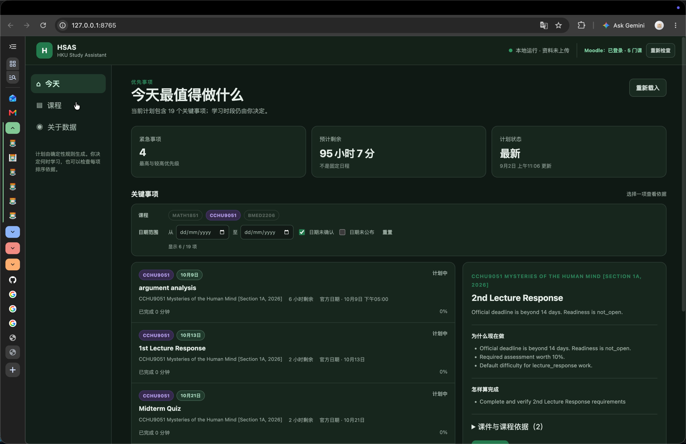
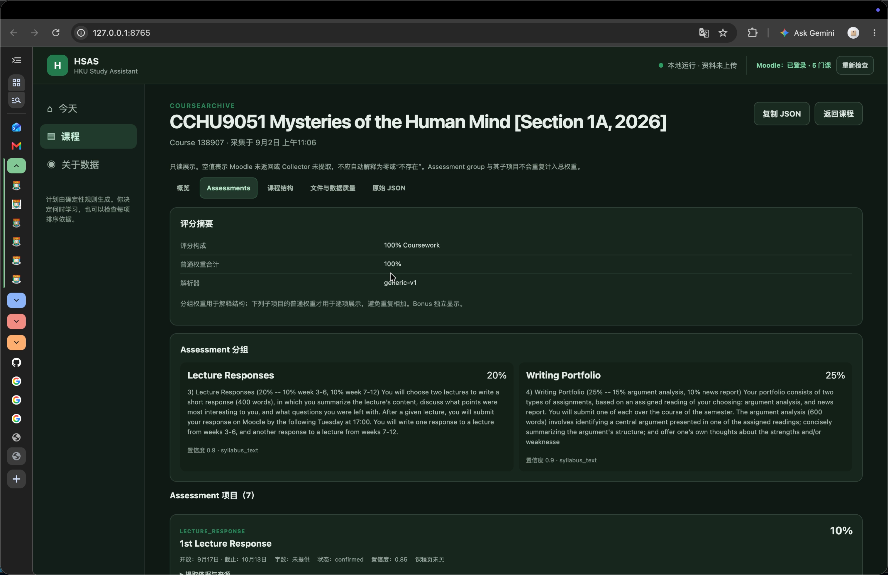
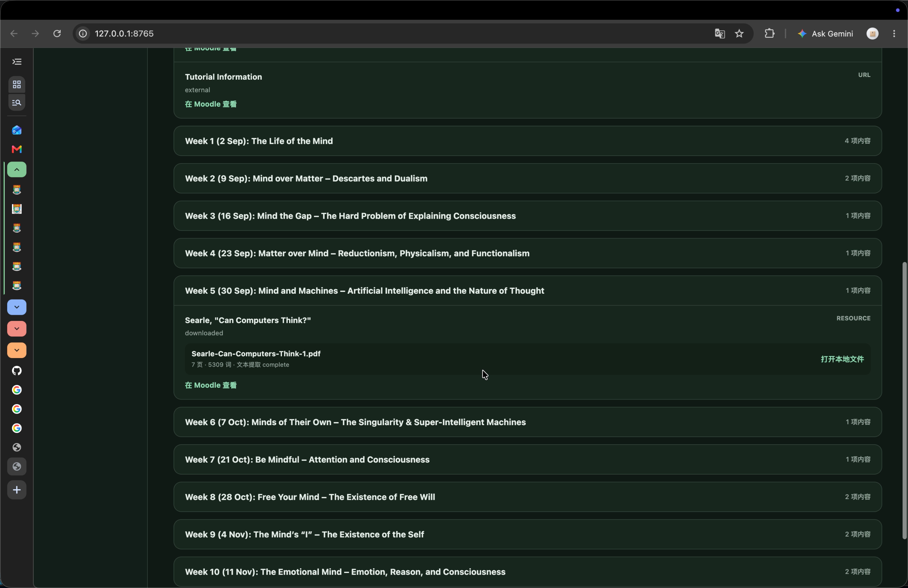
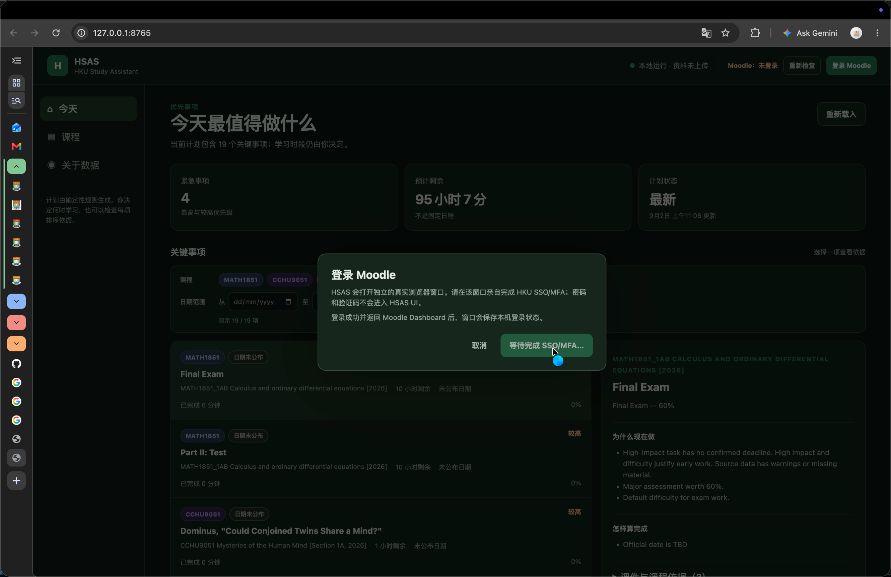
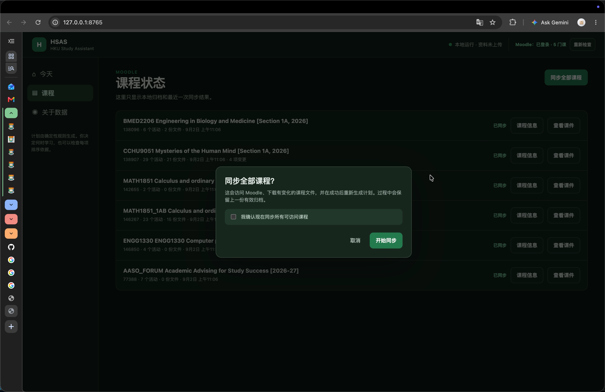

# HSAS — HKU Study Assistance System

> 把 Moodle 中分散的课程信息，变成今天真正值得完成的学习行动。

HSAS 是面向 HKU 学生的本地学习辅助系统。它同步 Moodle 中的作业、考试、截止日期、占分、
要求和课件，比较不同课程的紧迫程度与学习成本，再把最重要的事项整理成带理由、预计投入和
完成标准的学习清单。

它也会通过本地 RAG 从真实课件中寻找相关内容，让 AI 根据课程文件解释知识、设计练习，
并标明文件与页码来源。学生记录实际进度后，后续计划会随之更新。

## 与 AI Agent 配合

HSAS 已设计好可供 AI Agent 读取的 AI Skills。Skills 描述系统能力、操作入口、数据写入
流程、计划解释方法和学习指导规则，让 Agent 能与 HSAS 联合运行：检查数据新鲜度、同步
课程、解释优先级、检索课件，并根据课程依据设计学习方法和自测标准。

~~~text
src/AI_Skills/
├── SKILL.md
├── Handbook.md
├── Task.md
├── agents/
│   └── openai.yaml
└── references/
    ├── data-write-protocols.md
    ├── evals.md
    ├── operations.md
    ├── plan-explanation.md
    └── study-guidance.md
~~~

例如：

~~~text
同步课程并更新计划，然后解释最高优先级的三项任务。
检索最高优先事项对应的课件，告诉我应该先理解什么。
根据课件内容设计一组练习，并说明每道题检验什么。
记录我今天的完成进度，再重新评估剩余任务。
~~~

## UI 演示

### 今日优先事项

Dashboard 将跨课程优先事项、预计剩余时间、计划状态和任务依据放在同一视野中。

<table>
  <tr>
    <td width="50%">
      <strong>Assessment 与占分结构</strong> 
      
    </td>
    <td width="50%">
      <strong>课程结构与本地课件</strong> 
      
    </td>
  </tr>
  <tr>
    <td width="50%">
      <strong>HKU SSO/MFA 登录引导</strong> 
      
    </td>
    <td width="50%">
      <strong>课程同步确认</strong> 
      
    </td>
  </tr>
</table>

## 目录

- [与 AI Agent 配合](#与-ai-agent-配合)
- [UI 演示](#ui-演示)
- [核心痛点与解决方式](#核心痛点与解决方式)
- [一次完整的使用流程](#一次完整的使用流程)
- [与相关产品的对比](#与相关产品的对比)
- [快速开始](#快速开始)
- [本地数据](#本地数据)
- [项目文档](#项目文档)
- [License](#license)

## 核心痛点与解决方式

| 学生面对的情况 | HSAS 形成的结果 |
|---|---|
| DDL、考试和要求散落在课程页面、公告、Label、syllabus 与 PDF 中 | 汇总课程任务、日期、占分、要求、课件及其来源 |
| 多门课程同时推进，很难比较哪件事最重要 | 生成跨课程优先级，并展示排序理由、预计投入与完成标准 |
| 论文、考试和项目规模很大，当前行动不清楚 | 根据任务类型拆成连续阶段，让下一步可以直接开始 |
| AI 建议缺少当前课程背景 | 通过本地 RAG 检索真实课件，并返回文件与页码依据 |
| 实际学习速度与原计划不同 | 根据投入时间和完成进度校准剩余工作与后续优先级 |
| Moodle 更新后，旧计划可能失去依据 | 比较课程变化，记录同步状态并检查计划所依据的数据版本 |

## 一次完整的使用流程

~~~text
同步 HKU Moodle
    ↓
得到课程事实：作业、考试、DDL、占分、要求、课件与来源
    ↓
比较所有课程，生成当前优先事项与阶段目标
    ↓
通过本地 RAG 找到相关课件和页码
    ↓
AI 给出有课程依据的解释、练习与自测方法
    ↓
学生记录真实进度，HSAS 刷新剩余工作与优先级
~~~

HSAS 生成的是持续更新的优先事项清单。它说明当前关注什么、为什么重要、预计投入多少、
怎样算完成；具体学习日期和时段由学生结合课程、休息与现实安排选择。

## 与相关产品的对比

| 使用场景 | Moodle | 待办或日历工具 | 通用 AI 助手 | HSAS |
|---|---|---|---|---|
| 课程信息 | 提供课程页面、公告、活动与课件 | 保存学生录入的任务和日期 | 根据对话中提供的内容作答 | 汇总 Moodle 中的任务、日期、占分、要求、课件与来源 |
| 多门课程安排 | 按课程分别展示内容 | 按日期、标签或手动顺序排列 | 根据当前对话提出建议 | 结合紧迫程度、重要性、工作量和进度计算跨课程优先级 |
| 学习任务拆解 | 展示教师发布的要求 | 记录清单、日程和提醒 | 生成通用步骤或对话建议 | 根据论文、考试、项目和演示的特点生成阶段目标 |
| 课件辅助学习 | 提供原始课程资料 | 关联手动添加的附件或链接 | 使用用户提供的文字和文件 | 通过本地 RAG 检索课件并返回文件与页码来源 |
| 进度更新 | 展示活动状态和课程记录 | 由学生维护完成状态 | 在对话中接收进度信息 | 记录实际投入与完成进度，并刷新后续优先事项 |
| 数据位置 | 学校 Moodle 平台 | 取决于所用服务 | 取决于所用服务 | 个人学习数据与下载资料保存在本地数据目录 |

## 快速开始

### 环境要求

- macOS 或 Linux
- Python 3.11 或更高版本
- 可正常访问 HKU Moodle 的账号
- 首次登录时由用户本人完成 HKU SSO/MFA

### 安装

~~~bash
git clone https://github.com/Jerry6921/HSAS.git
cd HSAS
python3.11 -m venv .venv
source .venv/bin/activate
python -m pip install -c requirements.lock -e .
playwright install chromium
~~~

### 开始使用

~~~bash
hsas ui
~~~

浏览器会打开本地 Dashboard。首次使用时，在界面中依次完成 Moodle 登录和课程同步。

偏好终端的用户可以使用：

~~~bash
hsas list-status       # 查看登录、同步和计划状态
hsas login             # 完成 Moodle 登录
hsas sync-courses      # 同步全部课程
hsas update-plan       # 刷新优先事项
~~~

运行 hsas --help 或相应子命令的 --help 可以查看完整选项。

## 本地数据

macOS 默认数据目录为：

~~~text
~/Library/Application Support/HSAS/
├── config.toml
├── browser-profile/
├── resources/
│   ├── courses/
│   ├── student_profile.json
│   ├── execution_log.json
│   └── integrated_plan.json
└── state/
~~~

Linux 使用平台标准用户数据目录。macOS 和 Linux 都可以通过 HSAS_DATA_DIR 自定义位置。
程序启动时会自动建立所需文件夹，业务数据会在相应操作首次成功执行时生成。

## 项目文档

- [架构、文件职责、依赖关系与内部工作流](ARCHITECTURE.md)
- [Moodle 同步、配置与课程数据说明](MOODLE_COLLECTOR.md)
- [数据与更新边界](SECURITY.md)
- [参与开发](CONTRIBUTING.md)

## License

HSAS 软件采用 [PolyForm Noncommercial License 1.0.0](LICENSE)。该许可证涵盖个人学习、
研究、实验，以及其他获准的非商业用途；商业使用需要获得版权持有人的另行授权。

从 Moodle 下载的课程资料继续适用其原有版权与使用条件，不属于 HSAS 软件许可证的授权
范围。
